# 第二部分：实例篇

# 结构化方法实例学习

## 三个数据库系统的分析与设计 + AI-IDE工具实践

**说明**：本部分供自学，每个案例后附有AI-IDE工具实践环节

---

# 实例篇目录

**案例一**：客户信息管理系统（dBase实现）

- AI实践1：用Trae生成DFD/ER图及dBase代码

**案例二**：销售订单管理系统（关系数据库实现）

- AI实践2：用Trae生成模块结构图及SQL代码

**案例三**：迷你关系数据库管理系统（RDBMS）的设计

- AI实践3：用Trae生成系统架构图及核心代码

**各案例对比与总结**

**AI-IDE工具使用技巧总结**

---

# 案例一：客户信息管理系统（dBase实现）

---

# 案例一：系统功能与角色

**系统功能**：

- 客户信息录入
- 客户信息修改
- 客户查询
- 销售统计

**用户角色**：

|角色|可用功能|
|:---|:---|
|销售员|录入、修改|
|经理|查询、统计|

---

# 案例一：DFD上下文图

PlantUML：

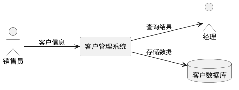

---

# 案例一：DFD Level 1

PlantUML：

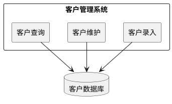

---

# 案例一：数据字典

**CUSTOMER表**：

|字段|类型|说明|
|:---|:---|:---|
|cust_id|Numeric|客户ID（主键）|
|name|Character|客户姓名|
|company|Character|公司|
|phone|Character|电话|
|city|Character|城市|

**SALES表**：

|字段|类型|说明|
|:---|:---|:---|
|sale_id|Numeric|销售ID（主键）|
|cust_id|Numeric|客户ID（外键）|
|product|Character|产品|
|amount|Numeric|销售金额|

---

# 案例一：ER图

PlantUML ER：

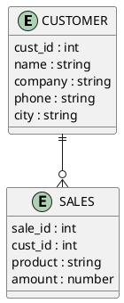

---

# 案例一：数据库设计（dBase）

- 使用dBase III/IV，文件型数据库
- 表文件：CUSTOMER.DBF、SALES.DBF
- 字段类型：Numeric、Character
- 运行环境：MS-DOS，单机

---

# 案例一：模块结构设计

PlantUML：

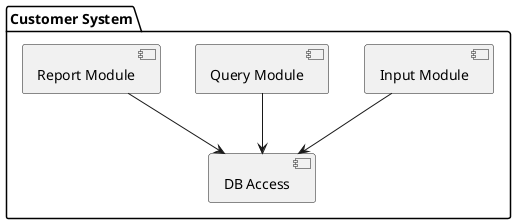

---

# 案例一：dBase程序示例

**创建数据库**

```dbase
CREATE CUSTOMER
```

**插入记录**

```dbase
USE CUSTOMER
APPEND BLANK
REPLACE name WITH "李华"
REPLACE city WITH "北京"
```

**查询数据**

```dbase
USE CUSTOMER
LIST FOR city="北京"
```

---

# AI实践1：用Trae生成DFD/ER图及dBase代码

---

# AI实践1-1：准备工作——安装Trae插件

**Trae插件简介**：

字节出品的免费AI编程助手，支持VS Code和JetBrains系列IDE

**安装步骤**：

1. 在VS Code扩展商店搜索"Trae"
2. 点击Install安装
3. 重启IDE，登录账号

**两种工作模式**：

- **Chat模式**：问答式辅助，适合局部代码生成和解释
- **Builder模式**：全自动AI工程师，可从0到1搭建完整项目

---

# AI实践1-2：用自然语言生成ER图

**核心技巧**：AI可以直接输出Mermaid格式的图表代码

**操作步骤**：

1. 在Trae中打开一个新文件（如er_diagram.md）
2. 输入以下Prompt：

```
请为"客户信息管理系统"生成ER图，使用Mermaid语法。
实体包括：客户(CUSTOMER)和销售(SALES)，一个客户可以有多次销售记录。
客户属性：客户ID、姓名、公司、电话、城市
销售属性：销售ID、客户ID、产品、销售金额
请输出可以直接渲染的Mermaid代码。
```

3. Trae会生成Mermaid代码
4. 在VS Code中安装Mermaid预览插件，即可实时查看渲染效果

---

# AI实践1-3：用自然语言生成DFD

**Prompt示例**：

```
请为"客户信息管理系统"生成数据流图（DFD）的上下文图和0层图，使用Mermaid语法。
系统名称：客户管理系统
外部实体：销售员、经理
数据存储：客户数据库
主要功能：客户录入、客户维护、客户查询
```

**技巧**：如果对生成的图不满意，可以继续对话优化，例如"请把客户录入和客户维护合并为一个加工"

---

# AI实践1-4：用Builder模式生成完整dBase项目

**Builder模式特点**：AI可以自主拆解任务、创建文件、生成代码

**操作步骤**：

1. 在Trae中切换到Builder模式
2. 输入以下指令：

```
创建一个dBase III的客户信息管理系统，实现以下功能：
1. 客户信息录入（姓名、公司、电话、城市）
2. 客户信息修改
3. 客户查询（按城市查询）
4. 销售统计（按产品统计销售金额）

需要生成：
- 数据库文件结构（CUSTOMER.DBF, SALES.DBF）
- 所有功能的.PRG程序文件
- 简单的菜单系统
```

3. Builder会自动创建文件结构并生成代码
4. 审查生成的代码，点击"全部采纳"确认

---

# AI实践1-5：Builder模式生成代码示例

**AI生成的CUSTOMER.DBF结构**：

```dbase
* 创建客户表
CREATE CUSTOMER.DBF
* 定义字段
DEFINE FIELD cust_id, TYPE N, WIDTH 10
DEFINE FIELD name, TYPE C, WIDTH 30
DEFINE FIELD company, TYPE C, WIDTH 50
DEFINE FIELD phone, TYPE C, WIDTH 20
DEFINE FIELD city, TYPE C, WIDTH 30
```

**AI生成的菜单程序**：

```dbase
* MAINMENU.PRG
DO WHILE .T.
  CLEAR
  @ 5,20 SAY "客户信息管理系统"
  @ 7,20 SAY "1. 录入客户"
  @ 8,20 SAY "2. 修改客户"
  @ 9,20 SAY "3. 查询客户"
  @ 10,20 SAY "4. 销售统计"
  @ 11,20 SAY "0. 退出"
  WAIT "请选择(0-4):" TO choice
  DO CASE
    CASE choice = "1"
      DO INPUT
    CASE choice = "2"
      DO UPDATE
    CASE choice = "3"
      DO QUERY
    CASE choice = "4"
      DO REPORT
    CASE choice = "0"
      EXIT
  ENDCASE
ENDDO
```

**说明**：AI生成的代码可能需要微调，但可以节省大量基础编码时间

---

# AI实践1-6：实践要点总结

**有效的Prompt技巧**：

- ✅ 明确技术栈："使用dBase III语法"
- ✅ 明确功能清单："需要录入、修改、查询、统计"
- ✅ 明确输出要求："生成.PRG文件"

**AI生成图的优势**：

- 快速生成Mermaid代码，可直接嵌入文档
- 支持迭代修改："把ER图中的属性补全"

**注意事项**：

- 生成代码需人工审查
- dBase是老技术，AI训练数据可能有限，需验证语法正确性

---

# 案例二：销售订单管理系统（关系数据库实现）

---

# 案例二：系统功能描述

- 订单录入、修改、删除
- 产品信息管理
- 订单查询（按客户、日期、产品）
- 销售统计（按月、按产品）

---

# 案例二：角色与用例

|角色|用例|
|:---|:---|
|销售员|订单录入、修改、查询|
|仓库管理员|产品库存管理|
|经理|销售统计、报表查看|

---

# 案例二：DFD上下文图

PlantUML：

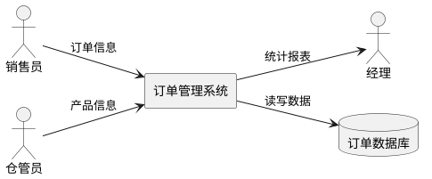

---

# 案例二：DFD Level 1

PlantUML：

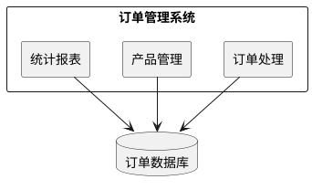

---

# 案例二：数据字典（主要表）

- **CUSTOMER（客户表）**
- **PRODUCT（产品表）**
- **ORDER（订单主表）**
- **ORDER_DETAIL（订单明细表）**

---

# 案例二：ER图

PlantUML ER：

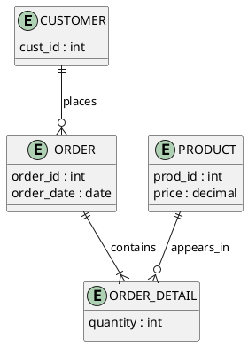

---

# 案例二：关系模式设计（SQL）

```sql
CREATE TABLE CUSTOMER (
  cust_id INT PRIMARY KEY,
  name VARCHAR(50)
);

CREATE TABLE PRODUCT (
  prod_id INT PRIMARY KEY,
  name VARCHAR(50),
  price DECIMAL(10,2)
);

CREATE TABLE ORDER (
  order_id INT PRIMARY KEY,
  cust_id INT,
  order_date DATE,
  FOREIGN KEY (cust_id) REFERENCES CUSTOMER(cust_id)
);

CREATE TABLE ORDER_DETAIL (
  detail_id INT PRIMARY KEY,
  order_id INT,
  prod_id INT,
  quantity INT,
  FOREIGN KEY (order_id) REFERENCES ORDER(order_id),
  FOREIGN KEY (prod_id) REFERENCES PRODUCT(prod_id)
);
```

---

# AI实践2：用Trae生成模块结构图及SQL代码

---

# AI实践2-1：生成模块结构图

**Prompt示例**：

```
请为"销售订单管理系统"生成模块结构图，使用PlantUML语法。
系统模块包括：
- 订单处理模块（订单录入、修改、删除）
- 产品管理模块（产品增删改查）
- 统计报表模块（月度统计、产品统计）

请输出PlantUML组件图代码。
```

---

# AI实践2-2：生成SQL建表语句

**Prompt示例**：

```
请为"销售订单管理系统"生成SQL建表语句。
需要以下表：
1. 客户表(CUSTOMER)：客户ID、姓名、电话、地址
2. 产品表(PRODUCT)：产品ID、产品名称、单价、库存
3. 订单表(ORDER)：订单ID、客户ID、订单日期、总金额
4. 订单明细表(ORDER_DETAIL)：明细ID、订单ID、产品ID、数量小计

请生成完整的CREATE TABLE语句，包含主键和外键约束。
```

---

# AI实践2-3：生成业务SQL查询

**Prompt示例**：

```
请为"销售订单管理系统"生成以下SQL查询语句：
1. 查询所有未完成订单
2. 查询销售额前10名的产品
3. 查询每个客户的订单总数和总金额
4. 查询指定月份的销售统计

请使用标准SQL语法。
```

---

# AI实践2-4：生成完整的业务层代码

在Builder模式下输入：

```
创建一个Java Spring Boot项目，实现销售订单管理系统的REST API。

需要实现：
1. 订单CRUD操作
2. 产品管理
3. 按客户查询订单
4. 按月统计销售额

使用MySQL数据库，JPA作为ORM，三层架构（Controller, Service, Repository）。

请生成完整的项目结构和代码文件。
```

**Builder执行过程**：

1. 分析需求，创建项目结构
2. 生成Entity类
3. 生成Repository接口
4. 生成Service类
5. 生成Controller类
6. 生成配置文件
7. 提示运行项目

---

# AI实践2-5：Builder生成的代码示例

**AI生成的Order实体类**：

```java
@Entity
@Table(name = "orders")
public class Order {

    @Id
    @GeneratedValue(strategy = GenerationType.IDENTITY)
    private Integer orderId;

    @ManyToOne
    @JoinColumn(name = "cust_id")
    private Customer customer;

    @Column(name = "order_date")
    private Date orderDate;

    @OneToMany(mappedBy = "order", cascade = CascadeType.ALL)
    private List<OrderDetail> orderDetails;

    // getters and setters
}
```

**AI生成的Controller**：

```java
@RestController
@RequestMapping("/api/orders")
public class OrderController {

    @Autowired
    private OrderService orderService;

    @GetMapping("/customer/{custId}")
    public List<Order> getOrdersByCustomer(@PathVariable Integer custId) {
        return orderService.findByCustomerId(custId);
    }

    @GetMapping("/statistics/monthly")
    public List<MonthlySales> getMonthlySales() {
        return orderService.getMonthlySalesStatistics();
    }
}
```

---

# AI实践2-6：上下文引用的高级技巧

**引用文件作为上下文**：

在Trae中输入`#`可以引用当前项目中的文件

例如："请修改#OrderController.java，增加一个根据日期范围查询订单的接口"

**逐步迭代开发**：

- 第1轮：创建基本的订单管理系统框架
- 第2轮：为之前的项目添加JWT认证支持
- 第3轮：添加Swagger API文档
- 第4轮：编写单元测试

**版本回退功能**：

- 如果不满意AI的修改，可以回退到之前的版本
- 支持回退到最近10轮会话内的任意版本

---

# 幻灯片 24：案例二 模块结构图

PlantUML：

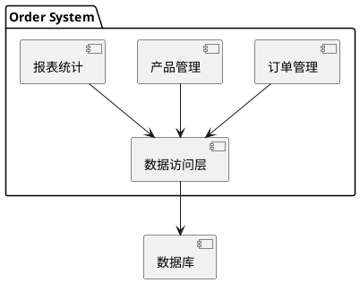

---

# AI实践2：用Trae生成模块结构图及SQL代码

---

# 案例三：系统背景

随着企业系统规模扩大，出现了真正的关系数据库系统（RDBMS）

**典型代表**：

- IBM DB2
- Oracle
- Informix

**理论基础**：Edgar F. Codd 的关系模型。

---

# 幻灯片 30：案例三 问题定义与目标

**目标**：设计一个支持基本SQL操作的单用户关系数据库引擎

**功能需求**：

- 支持 CREATE TABLE、INSERT、SELECT、UPDATE、DELETE
- 支持简单条件查询（WHERE）
- 数据持久化存储在文件中

---

# 幻灯片 31：案例三 DFD上下文图

PlantUML：

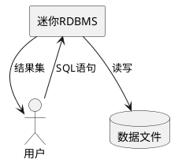

---

# 幻灯片 32：案例三 DFD Level 1

PlantUML：

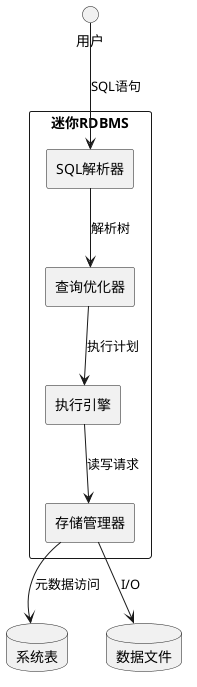

---

# 幻灯片 33：案例三 系统表设计（数据字典）

- **TABLES 表**：记录所有表的信息
- **COLUMNS 表**：记录列的信息

---

# 幻灯片 34：案例三 模块结构图

PlantUML：

```plantuml
@startuml

package "MiniRDBMS" {

  component "SQL Parser"
  component "Optimizer"
  component "Executor"
  component "Storage Engine"
  component "Catalog Manager"

}

SQL Parser --> Optimizer
Optimizer --> Executor
Executor --> Storage Engine
Executor --> Catalog Manager
Storage Engine --> [Data Files]
Catalog Manager --> [System Tables]

@enduml
```

---

# 案例三：系统功能

- SQL解析与执行
- 事务管理（ACID）
- 并发控制
- 索引管理
- 查询优化

---

# 案例三：系统架构

PlantUML：

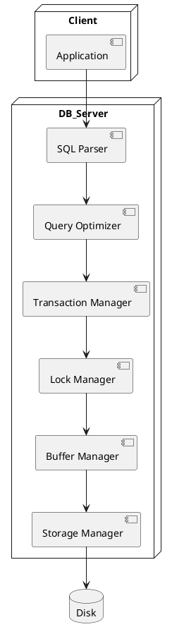

---

# 案例三：核心模块设计

**SQL Parser**：

- 词法分析
- 语法分析
- 生成抽象语法树（AST）

**Query Optimizer**：

- 查询重写
- 执行计划生成
- 成本估算

**Transaction Manager**：

- 事务开始/提交/回滚
- 日志管理

**执行引擎**：

- 按执行计划调用存储引擎接口

**存储管理器**：

- 管理数据页、记录格式、索引（可选）

**目录管理器**：

- 维护系统表，提供元数据访问

---

# 幻灯片 35：案例三 核心模块设计说明

- **SQL解析器**：词法/语法分析，生成抽象语法树
- **查询优化器**：基于规则简化，生成执行计划（如选择下推）
- **执行引擎**：按执行计划调用存储引擎接口
- **存储管理器**：管理数据文件的读写
- **目录管理器**：管理系统表（元数据）

---

# AI实践3：用Trae生成系统架构图及核心代码

---

# AI实践3-1：生成系统架构图

**Prompt示例**：

```
请为"迷你关系数据库管理系统"生成系统架构图，使用PlantUML或Mermaid语法。
系统包含以下核心组件：
- 客户端连接管理
- SQL解析器
- 查询优化器
- 执行器
- 事务管理器
- 存储管理器

请生成清晰的架构图。
```

---

# AI实践3-2：生成简单SQL解析器代码

**Prompt示例**：

```
请用Rust语言实现一个简单的SQL解析器，能够解析：
- SELECT语句（FROM, WHERE, ORDER BY）
- INSERT语句
- CREATE TABLE语句

只需要支持基本的语法解析，返回解析后的结构体。
```

---

# AI实践3-3：生成事务管理代码

**Prompt示例**：

```
请用Rust语言实现一个简化的事务管理器，包含：
1. 事务的开始、提交、回滚方法
2. 简单的锁接口
3. WAL日志记录

请给出核心代码结构。
```

---

# AI实践3-4：用Chat模式调试和优化代码

- **代码解释**：选中代码，输入`/explain`，AI解释代码逻辑
- **问题修复**：选中出错代码，输入`/fix`，AI尝试修复
- **单测生成**：选中函数，输入`/test`，AI生成单元测试

**示例**：

```
/explain 请解释这段SELECT解析的逻辑
```

**效果**：快速理解复杂代码，提高学习效率

---

# 各案例对比与总结

---

# 三个案例的对比

|对比项|案例一|案例二|案例三|
|:---|:---|:---|:---|
|技术栈|dBase III|MySQL/PostgreSQL|自研RDBMS|
|数据存储|DBF文件|关系数据库|文件系统|
|复杂度|低|中|高|
|适用场景|单机桌面应用|企业业务系统|数据库内核开发|

---

# 结构化方法的演进

1. **文件数据库时代**（dBase）
   - 简单易用，单机应用
   - 无事务管理

2. **关系数据库时代**（DB2/Oracle）
   - 标准SQL
   - 完整的事务支持
   - 并发控制

3. **现代数据库系统**
   - 分布式架构
   - 高可用
   - 智能查询优化

---

# AI-IDE工具使用技巧总结

---

# AI辅助建模的最佳实践

**1. 明确需求后再开始**

- 先用自然语言描述系统
- 列出所有实体和关系

**2. 分步骤生成**

- 先生成ER图
- 再生成DFD
- 最后生成模块结构图

**3. 迭代优化**

- AI生成初版后人工审查
- 通过对话持续改进

---

# 常用Prompt模板

**生成ER图**：
```
请为[系统名称]生成ER图，使用[Mermaid/PlantUML]语法。
实体：[实体列表]
属性：[每个实体的属性]
关系：[实体间关系]
```

**生成DFD**：
```
请为[系统名称]生成数据流图。
外部实体：[角色列表]
数据存储：[存储列表]
处理功能：[功能列表]
```

**生成SQL**：
```
请生成[系统名称]的SQL建表语句。
表：[表名和字段]
约束：[主键、外键、约束条件]
```

---

# 课后练习

1. 选择一个熟悉的小系统（如图书管理系统），使用结构化方法进行分析和设计
2. 使用Trae生成ER图和DFD
3. 将设计转化为SQL建表语句
4. 尝试用Builder模式生成简单的增删改查代码

---

# 幻灯片 40：AI实践3-5 "Print-to-Image"高级技巧

**原理**：利用AI可以直接生成SVG代码的能力，通过脚本触发绘图

**Python脚本示例**：

```python
# generate_arch_diagram.py
def create_prompt(code_content, diagram_type):
    prompt = f"""
    --- DRAWING INSTRUCTION ---
    身份：技术插画师
    任务：根据以下代码内容，绘制一张{diagram_type}
    代码内容：{code_content}
    规范：使用SVG格式，包含viewBox，风格简洁现代
    直接输出SVG代码，不用Markdown代码块
    --- END INSTRUCTION ---
    """
    return prompt

if __name__ == "__main__":
    with open("main.py", "r") as f:
        code = f.read()
    print(create_prompt(code, "系统架构图"))
```

**运行**：`python generate_arch_diagram.py`，AI看到输出后自动生成SVG文件

**优势**：代码更新后，重新运行脚本即可更新架构图，保持文档同步

---

# 各案例对比与总结

---

# 幻灯片 41：三个案例对比

|案例|数据库类型|核心特点|适用场景|AI实践重点|
|:---|:---|:---|:---|:---|
|客户信息管理|dBase (文件型)|单机、简单、无事务|个人/小型应用|生成ER图/DFD，dBase代码|
|销售订单管理|关系型|结构化数据、SQL、事务|企业级业务系统|生成模块结构图，Spring Boot代码|
|迷你RDBMS|关系型引擎原型|模块化设计、教学演示|学习数据库实现原理|生成架构图，Python原型|

---

# 幻灯片 42：AI-IDE工具使用技巧总结

**Builder模式适用场景**：

- 从0到1搭建项目框架
- 生成标准化的CRUD代码
- 快速原型开发

**Chat模式适用场景**：

- 局部代码生成和修改
- 代码解释和学习
- Bug修复
- 生成图表

**生成图表的技巧**：

- 使用Mermaid语法，AI普遍支持
- 指定"用Mermaid格式输出"
- 可以迭代优化："把图改成从左到右布局"

**有效Prompt的要素**：

- 明确技术栈
- 明确功能需求
- 明确输出格式
- 提供参考示例

---

# 幻灯片 43：自学指导建议

1. 安装Trae插件，亲自体验Builder模式
2. 尝试用自然语言生成三个案例的各类图表
3. 修改Prompt，观察输出变化，理解AI的响应逻辑
4. 将生成的代码与手写代码对比，分析优缺点
5. **思考**：AI工具如何融入传统的结构化开发流程？

---

# 幻灯片 44：结束页

# 感谢观看

## 欢迎提问交流
