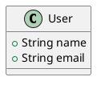
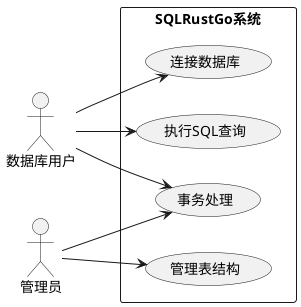

<!-- _class: lead -->

# 第二讲：结构化设计与UML基础

## AI增强的软件工程

---

# 课程大纲

1. **结构化设计方法**（25分钟）
2. **UML概述**（25分钟）
3. **用例图**（25分钟）
4. **实践练习**（15分钟）

---

# Part 1: 结构化设计方法

---

## 1.1 结构化设计的历史背景

### 1960-1970年代的软件危机

- 项目复杂度急剧增加
- 代码难以理解和维护
- 缺乏系统化的设计方法

### Dijkstra的贡献

- **"Go To Statement Considered Harmful"**（1968）
- 提出结构化编程的概念
- 奠定了现代软件工程的基础

---

## 1.2 核心思想

### 自顶向下、逐步求精

```
问题
  ├─ 子问题1
  │   ├─ 子问题1.1
  │   └─ 子问题1.2
  ├─ 子问题2
  │   ├─ 子问题2.1
  │   └─ 子问题2.2
  └─ 子问题3
```

### 模块化设计原则

- **高内聚、低耦合**
- **信息隐藏**
- **模块独立性**

---

## 1.3 结构化分析与设计工具

### 数据流图（DFD）

```
┌─────────┐      ┌─────────┐      ┌─────────┐
│ 外部实体 │ ---> │ 处理过程 │ ---> │ 数据存储 │
└─────────┘      └─────────┘      └─────────┘
     │                │
     └────────────────┘
          数据流
```

### 数据字典

- 定义数据元素的含义
- 规范数据格式和约束

### 结构图

- 描述模块之间的调用关系
- 展示系统层次结构

---

## 1.4 结构化设计的优缺点

### 优点

- ✅ **清晰**：层次分明，易于理解
- ✅ **系统**：有完整的方法论支持
- ✅ **可追溯**：从需求到设计有清晰的映射

### 缺点

- ⚠️ **刚性**：难以应对需求变化
- ⚠️ **不适应变化**：修改成本高

### 对AI辅助开发的启示

- 结构化思维有助于提示词设计
- 分层分解有助于模块化开发
- AI可以辅助生成DFD、结构图等

---

# Part 2: UML概述

---

## 2.1 UML的历史和发展

### 面向对象方法论的统一

- **1990年代**：多种OO方法并存
- **1997年**：UML 1.0发布
- **2005年**：UML 2.0发布

### UML在软件工程中的地位

- **标准化**：国际标准建模语言
- **通用性**：适用于各种软件开发
- **可视化**：图形化表示系统结构

---

## 2.2 UML 2.0 分类

### 结构图（Structure Diagrams）

- **类图**（Class Diagram）
- **对象图**（Object Diagram）
- **组件图**（Component Diagram）
- **部署图**（Deployment Diagram）

### 行为图（Behavior Diagrams）

- **用例图**（Use Case Diagram）
- **顺序图**（Sequence Diagram）
- **活动图**（Activity Diagram）
- **状态图**（State Diagram）

---

## 2.3 UML工具介绍

### PlantUML（文本到图形）

**优点**：
- ✅ 版本控制友好
- ✅ AI易生成
- ✅ 文本格式，易于编辑

**基本语法**：



### 其他工具

- **Draw.io / diagrams.net**
- **StarUML / Enterprise Architect**
- **AI辅助UML绘图**

---

# Part 3: 用例图

---

## 3.1 用例图的组成元素

### 参与者（Actor）

- **用户角色**：管理员、普通用户
- **外部系统**：支付系统、消息队列

### 用例（Use Case）

- **功能描述**：系统提供的功能
- **命名规范**：动词+名词（如"创建订单"）

### 系统边界（System Boundary）

- 定义系统的范围
- 区分系统内部和外部

---

## 3.2 用例之间的关系

### 关联（Association）

- 参与者与用例之间的连线
- 表示参与者使用该用例

### 包含（Include）

- 用例A总是包含用例B的行为
- `<<include>>` 依赖关系

### 扩展（Extend）

- 用例A可选地扩展用例B的行为
- `<<extend>>` 依赖关系

### 泛化（Generalization）

- 用例之间的继承关系
- 子用例继承父用例的行为

---

## 3.3 实例：SQLRustGo用例图

### 参与者识别

- **数据库用户**
- **管理员**
- **客户端程序**

### 用例识别

- 连接数据库
- 执行SQL查询
- 管理表结构
- 事务处理

---

## 3.3 实例：SQLRustGo用例图（续）

### 使用AI生成用例图

**提示词设计**：

```
为SQLRustGo数据库系统生成用例图，要求：
1. 参与者：数据库用户、管理员
2. 用例：连接数据库、执行SQL查询、管理表结构、事务处理
3. 使用PlantUML语法
4. 包含用例之间的关系
```

### PlantUML代码生成



---

# Part 4: 实践练习

---

## 4.1 绘制SQLRustGo用例图

### 任务

1. 使用PlantUML语法绘制用例图
2. 至少包含5个用例
3. 标注用例之间的关系

### AI辅助优化

- 使用AI生成初始版本
- 人工审查和补充
- 迭代优化

---

## 4.2 编写用例描述

### 用例描述模板

| 项目 | 内容 |
|------|------|
| 用例名称 | 执行SQL查询 |
| 参与者 | 数据库用户 |
| 前置条件 | 已连接数据库 |
| 主成功场景 | 1. 用户输入SQL语句<br>2. 系统解析SQL<br>3. 系统执行查询<br>4. 系统返回结果 |
| 后置条件 | 查询结果已返回 |

---

# 核心知识点总结

---

## 1. 结构化设计

- **自顶向下、逐步求精**
- **高内聚、低耦合**
- **数据流图（DFD）的应用**

## 2. UML基础

- **UML 2.0分类**：结构图 vs 行为图
- **PlantUML文本化建模**
- **AI辅助UML绘图**

## 3. 用例图

- **参与者、用例、系统边界**
- **包含、扩展、泛化关系**
- **用例描述规范**

---

# 课堂互动

---

## 练习

1. 绘制SQLRustGo用例图
2. 编写2个核心用例的详细描述

## 讨论

结构化设计在AI时代还有价值吗？

## 实践

使用AI生成PlantUML代码

---

# 课后作业

---

## 任务

1. 完成SQLRustGo用例图（至少5个用例）
2. 编写2个核心用例的详细描述
3. 阅读PlantUML官方文档

## 预习

- 面向对象设计原则
- SOLID原则

---

<!-- _class: lead -->

# 谢谢！

## 下节课：面向对象设计与类图
