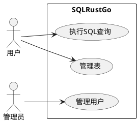

<!-- _class: lead -->

# 第二讲：结构化设计与UML基础

## AI增强的软件工程（🚗 自动档阶段）

---

# 课程大纲

1. **结构化设计方法**（20分钟）
2. **UML概述**（20分钟）
3. **用例图**（25分钟）
4. **AI辅助UML绘制**（15分钟）

---

# Part 1: 结构化设计方法

---

## 1.1 结构化设计核心思想

### 自顶向下、逐步求精

```
系统
  │
  ├── 子系统1
  │    ├── 模块1.1
  │    └── 模块1.2
  │
  └── 子系统2
       ├── 模块2.1
       └── 模块2.2
```

### 设计原则

- **高内聚**：模块只做一件事
- **低耦合**：模块之间依赖少
- **信息隐藏**：模块内部细节隐藏

---

## 1.2 数据流图（DFD）

### 符号

```
○ → 加工（Process）
□ → 数据源（Source/Sink）
→ → 数据流（Data Flow）
~ → 数据存储（Data Store）
```

---

# Part 2: UML概述

---

## 2.1 UML分类

### 结构图

- 类图、对象图
- 组件图、部署图

### 行为图

- 用例图
- 顺序图、活动图
- 状态图

---

## 2.2 UML工具

| 工具 | 特点 | 适合 |
|------|------|------|
| PlantUML | 文本绘图 | 开发者 |
| Draw.io | 图形界面 | 设计师 |
| StarUML | 专业工具 | 大项目 |

---

# Part 3: 用例图

---

## 3.1 用例图元素

```
┌─────────────────────────────────────────────────────────────────────┐
│                    用例图元素                                        │
├─────────────────────────────────────────────────────────────────────┤
│                                                                      │
│    ┌────────┐                                                      │
│    │  参与者  │ ← 用 stickman 表示                                 │
│    └────┬───┘                                                      │
│         │                                                          │
│         │                                                          │
│    ┌────▼────┐                                                    │
│    │  用例   │ ← 椭圆表示                                         │
│    └─────────┘                                                    │
│                                                                      │
│    关系：包含、扩展、泛化                                          │
│                                                                      │
└─────────────────────────────────────────────────────────────────────┘
```

---

## 3.2 SQLRustGo用例图示例

```
    ┌─────────┐
    │  用户   │
    └────┬────┘
         │
    ┌────┼────┐
    │         │
    ▼         ▼
┌───────┐ ┌───────┐
│执行SQL│ │管理表 │
└───┬───┘ └───┬───┘
    │         │
    └────┬────┘
         │
    ┌───▼────┐
    │数据库系统│
    └─────────┘
```

---

# Part 4: AI辅助UML绘制

---

## 4.1 使用AI生成PlantUML

### 提示词示例

```
帮我生成SQLRustGo的用例图PlantUML代码：
- 参与者：用户、管理员
- 用例：执行查询、管理表、管理用户
- 包含关系
```

### AI生成结果


```plantuml
@startuml
left to right direction
actor User as "用户"
actor Admin as "管理员"
rectangle "SQLRustGo" {
  User --> (执行SQL查询)
  User --> (管理表)
  Admin --> (管理用户)
}
@enduml
```

---

## 4.2 自动档阶段的AI使用技巧

### 正确方式

| 场景 | AI能做的 | 人类要做的 |
|------|---------|-----------|
| 理解概念 | 解释定义 | 判断是否正确 |
| 绘制图形 | 生成代码 | 检查逻辑 |
| 改进设计 | 提供建议 | 做出决策 |

### 关键原则

- **AI生成** ≠ **最终方案**
- **必须理解** ≠ **直接使用**
- **参考为主** ≠ **复制为准**

---

# 核心知识点总结

---

## 1. 结构化设计

- **自顶向下**：分解问题
- **高内聚低耦合**：好的设计

## 2. UML基础

- **用例图**：描述功能需求
- **工具**：PlantUML

## 3. 自动档模式

- **AI辅助**：生成初稿
- **人类把关**：审核决策

---

# 课后作业

---

## 任务

1. 使用PlantUML绘制SQLRustGo用例图
2. 使用AI辅助生成和改进

## 预习

- 面向对象设计与类图

---

<!-- _class: lead -->

# 谢谢！

## 下节课：面向对象设计与类图
