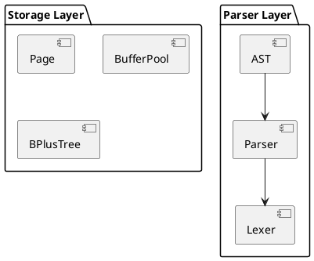

<!-- _class: lead -->

# 第五讲：架构设计原理与SQLRustGo架构

## AI增强的软件工程

---

# 课程大纲

1. **架构设计概述**（25分钟）
2. **SQLRustGo四层架构设计**（30分钟）
3. **架构图绘制实践**（20分钟）
4. **AI辅助架构设计实践**（10分钟）

---

# Part 1: 架构设计概述

---

## 1.1 What：什么是软件架构

### 定义

软件系统的高层结构，包括组件、组件关系、组件与环境的关系

### 架构的层次

- **业务架构**：业务流程、业务规则
- **应用架构**：功能模块、模块关系
- **数据架构**：数据模型、数据流向
- **技术架构**：技术选型、基础设施

---

## 1.1 What：什么是软件架构（续）

### 架构的核心要素

- **组件（Component）**：功能单元
- **连接器（Connector）**：组件间的通信机制
- **约束（Constraint）**：架构的限制条件

### 架构设计原则

- **高内聚低耦合**
- **关注点分离**
- **单一职责**
- **开闭原则**

---

## 1.2 Why：为什么需要架构设计

### 复杂性管理

- 大型系统包含数百万行代码
- 没有良好架构，系统无法理解和维护
- 架构提供系统的"地图"和"导航"

### 质量保证

- 架构决定系统的质量属性（性能、可扩展性、可靠性）
- 良好架构降低Bug数量
- 提高代码可读性和可维护性

---

## 1.2 Why：为什么需要架构设计（续）

### 团队协作

- 清晰的架构让多人协作成为可能
- 降低沟通成本
- 减少代码冲突

### 风险控制

- 架构设计提前识别风险
- 降低后期重构成本
- 提高系统稳定性

### 成本控制

- **架构设计成本 << 重构成本**
- 良好架构降低长期维护成本

---

## 1.2 Why：为什么需要架构设计（续）

### 业界案例

- **Google**：微服务架构支撑全球搜索
- **Netflix**：云原生架构支撑流媒体服务
- **微信**：分布式架构支撑亿级用户

---

## 1.3 How：如何进行架构设计

### 架构设计流程

1. **需求分析**：理解业务需求和技术约束
2. **架构风格选择**：选择合适的架构模式
3. **组件设计**：识别核心组件和接口
4. **架构评估**：评估架构方案的优劣
5. **迭代优化**：根据反馈持续优化

---

## 1.3 How：如何进行架构设计（续）

### 架构风格选择

| 架构风格 | 适用场景 | 优点 | 缺点 |
|---------|---------|------|------|
| 分层架构 | 企业应用 | 结构清晰 | 性能开销 |
| 微服务架构 | 大型分布式系统 | 可扩展 | 复杂度高 |
| 事件驱动架构 | 实时系统 | 解耦 | 调试困难 |
| 管道过滤器架构 | 数据处理系统 | 可组合 | 错误处理复杂 |

---

## 1.3 How：如何进行架构设计（续）

### 架构评估方法

- **ATAM**（Architecture Tradeoff Analysis Method）
- **SAAM**（Software Architecture Analysis Method）
- **架构权衡**：性能 vs 可扩展性 vs 复杂度

### AI辅助架构设计

```
设计一个数据库系统的架构，要求：
1. 支持SQL查询
2. 支持数据持久化
3. 支持事务处理
4. 支持并发访问
5. 使用Rust实现
请提供架构方案、组件划分、接口设计。
```

---

# Part 2: SQLRustGo四层架构设计

---

## 2.1 What：SQLRustGo的架构设计

### 整体架构图

```
┌─────────────────────────────────────────────────────────┐
│                    Parser Layer                          │
│         Lexer → Parser → AST                             │
│         功能：SQL解析、语法检查                           │
└─────────────────────────────────────────────────────────┘
                          ↓
┌─────────────────────────────────────────────────────────┐
│                    Planner Layer                         │
│         Logical Plan → Physical Plan                     │
│         功能：查询优化、执行计划生成                      │
└─────────────────────────────────────────────────────────┘
                          ↓
┌─────────────────────────────────────────────────────────┐
│                    Executor Layer                        │
│         Volcano Model → Operators                        │
│         功能：查询执行、结果返回                          │
└─────────────────────────────────────────────────────────┘
                          ↓
┌─────────────────────────────────────────────────────────┐
│                    Storage Layer                         │
│         Page → BufferPool → B+Tree → WAL                 │
│         功能：数据存储、索引管理、事务支持                │
└─────────────────────────────────────────────────────────┘
```

---

## 2.2 Why：为什么选择四层架构

### 分层架构的优势

- **关注点分离**：每层专注自己的职责
- **易于理解**：清晰的层次结构
- **易于测试**：每层可独立测试
- **易于扩展**：可以替换某一层的实现

### 数据库系统的特性

- **解析层**：处理SQL语法，与存储无关
- **规划层**：优化查询，与具体存储无关
- **执行层**：执行查询，依赖存储层
- **存储层**：管理数据，独立于上层

---

## 2.2 Why：为什么选择四层架构（续）

### 教学价值

- 每层对应数据库系统的核心概念
- 学生可以逐层学习和实现
- 适合AI辅助开发（每层相对独立）

### 可扩展性

- 可以添加新的SQL语法（修改Parser层）
- 可以添加新的优化规则（修改Planner层）
- 可以添加新的执行算子（修改Executor层）
- 可以添加新的存储引擎（修改Storage层）

---

## 2.3 How：四层架构的详细设计

### Parser Layer（解析层）

**组件**：
- **Lexer**：词法分析器，将SQL字符串转换为Token流
- **Parser**：语法分析器，将Token流转换为AST
- **AST**：抽象语法树，表示SQL语句的结构

**输入**：SQL字符串
**输出**：AST（Statement枚举）

**关键技术**：
- 正则表达式（词法分析）
- 递归下降解析（语法分析）
- 错误处理和恢复

---

## 2.3 How：四层架构的详细设计（续）

### Planner Layer（规划层）

**组件**：
- **Logical Planner**：逻辑规划器，生成逻辑执行计划
- **Physical Planner**：物理规划器，生成物理执行计划
- **Optimizer**：查询优化器，优化执行计划

**输入**：AST（来自Parser层）
**输出**：Physical Plan（执行计划）

**关键技术**：
- 基于规则的优化（Rule-based Optimization）
- 基于成本的优化（Cost-based Optimization）
- 索引选择

---

## 2.3 How：四层架构的详细设计（续）

### Executor Layer（执行层）

**组件**：
- **ExecutionEngine**：执行引擎，协调算子执行
- **Operators**：执行算子（Scan, Filter, Project, Join等）
- **Volcano Model**：火山模型，算子迭代执行

**输入**：Physical Plan（来自Planner层）
**输出**：Query Result（查询结果）

**关键技术**：
- 迭代器模式（Iterator Pattern）
- 流水线执行（Pipeline Execution）
- 向量化执行（Vectorized Execution）

---

## 2.3 How：四层架构的详细设计（续）

### Storage Layer（存储层）

**组件**：
- **Page**：存储页，数据存储的基本单位
- **BufferPool**：缓冲池，管理内存中的页
- **BPlusTree**：B+树索引，加速数据查询
- **WAL**：Write-Ahead Log，预写日志，保证事务持久性
- **Transaction Manager**：事务管理器，管理ACID事务

**输入**：读写请求（来自Executor层）
**输出**：数据或操作结果

**关键技术**：
- 页式存储（Page-based Storage）
- 缓冲区管理（Buffer Management）
- B+树索引（B+ Tree Indexing）
- WAL日志（Write-Ahead Logging）
- 并发控制（Concurrency Control）

---

# Part 3: 架构图绘制实践

---

## 3.1 使用PlantUML绘制架构图

### PlantUML组件图语法



---

## 3.2 架构设计评审

### 评审要点

- 架构是否清晰？
- 职责是否分离？
- 是否易于扩展？
- 是否易于测试？

### 评审方法

- **同行评审**（Peer Review）
- **架构评估会议**（Architecture Review Meeting）
- **架构权衡分析**（Tradeoff Analysis）

---

# Part 4: AI辅助架构设计实践

---

## 4.1 使用AI生成架构方案

### 提示词设计

```
为SQLRustGo数据库系统设计架构，要求：
1. 支持SQL解析、查询优化、执行、存储
2. 采用分层架构
3. 每层职责明确
4. 使用Rust实现
请提供架构方案、组件划分、接口设计。
```

### 方案评估

- 评估架构的合理性
- 评估架构的可扩展性
- 评估架构的复杂度

---

## 4.2 使用AI生成架构图

### PlantUML代码生成

```
生成SQLRustGo四层架构的PlantUML代码，要求：
1. 包含Parser、Planner、Executor、Storage四层
2. 标注每层的核心组件
3. 标注层之间的依赖关系
```

### 图形渲染

- 使用PlantUML渲染图形
- 导出为PNG或SVG格式

### 文档输出

- 将架构图嵌入设计文档
- 编写架构说明

---

# 核心知识点总结

---

## 1. 架构设计

- **What**：软件架构的定义、层次、核心要素
- **Why**：复杂性管理、质量保证、团队协作、风险控制、成本控制
- **How**：架构设计流程、架构风格选择、架构评估方法、AI辅助设计

## 2. SQLRustGo四层架构

- **Parser Layer**：SQL解析
- **Planner Layer**：查询优化
- **Executor Layer**：查询执行
- **Storage Layer**：数据存储

## 3. 架构设计实践

- PlantUML绘制架构图
- 架构设计评审
- AI辅助架构设计

---

# 课后作业

---

## 任务

1. 完成SQLRustGo架构图（使用PlantUML）
2. 编写架构设计文档
3. 使用AI生成一个架构方案并评估

## 预习

- 功能模块划分
- 接口设计原则

---

<!-- _class: lead -->

# 谢谢！

## 下节课：功能模块划分与接口设计
