<!-- _class: lead -->

# 多AI Agent开发与软件治理

<br>

让 AI 从"写代码"到"守规矩"
—— 软件工程核心实践的 AI 增强版

---

## 课程大纲（2周4节课）

| 周次 | 课次 | 主题 | 核心内容 |
|------|------|------|----------|
| 第1周 | 第1课 | 从单点AI到多AI并行 | 为什么要并行？Prompt-Context-Harness 演进 |
| 第1周 | 第2课 | 测试基础：黑盒 vs 白盒 | 用图示讲透两种测试，覆盖率三层含义 |
| 第2周 | 第1课 | TDD 完整实践 | 红-绿-重构循环，用泳道图展示流程 |
| 第2周 | 第2课 | 软件治理与分支策略 | 分支保护、PR审查、CI/CD门禁，Harness落地 |

---

## Part 1: 从单点AI到多AI并行（第1周第1课）

---

### 1.1 回顾：前6周我们怎么工作的？

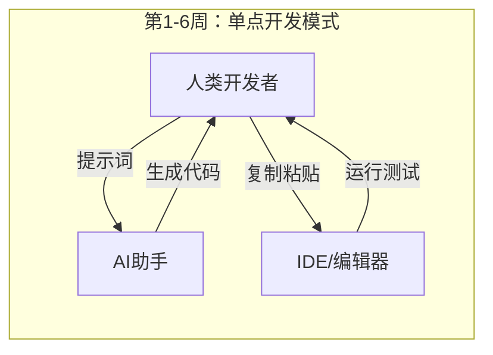

**特点：**

- 一个人 + 一个AI（Copilot、ChatGPT）
- 像"自动档汽车"：我下指令，AI执行
- 适合简单任务，但复杂系统开发时速度慢、容易出错

---

### 1.2 为什么要转向并行开发？

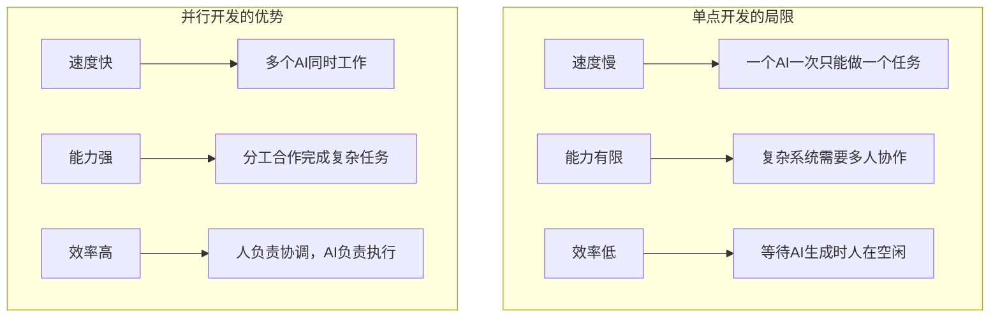

**核心转变**：从"提示词工程"到"多Agent编排工程"

---

### 1.3 并行开发带来的新挑战（为什么需要治理？）

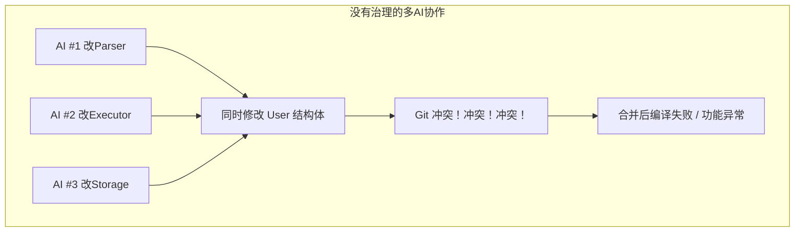

**三大挑战：**

1. AI之间会"打架"：同时修改同一文件、同一行代码
2. AI会"跑偏"：忘记整体架构，各自为战
3. 质量无法保证：没有统一规范，不知道谁写的代码有问题

---

### 1.4 解决方案：软件治理金字塔

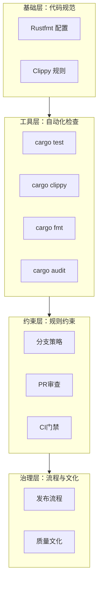

**核心思想**：用工具和规则代替对人的依赖，让 AI 和人类都遵守同一套标准。

---

### 1.5 Prompt-Context-Harness：AI协作的三阶演进

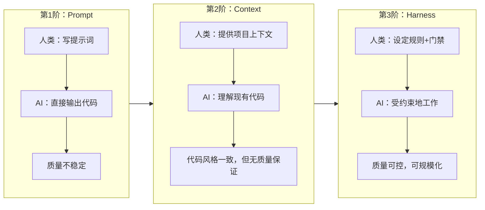

| 层级 | 核心特征 | 第1-6周 | 第8-16周 |
|------|---------|---------|----------|
| Prompt | 人类给指令，AI执行 | ✅ 主要方式 | 辅助方式 |
| Context | AI理解项目结构、历史 | 有限 | ✅ 通过OpenCode等 |
| Harness | 规则+测试+CI强制约束 | ❌ 无 | ✅ 核心保障 |

---

### 1.6 举例：开发一个"解析WHERE子句"的功能

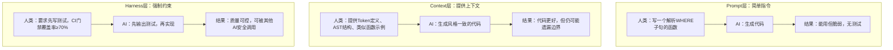

**结论**：Harness 层是让不懂编程的人也能管理复杂项目的关键。

---

## Part 2: 测试基础 —— 黑盒 vs 白盒（第1周第2课）

---

### 2.1 什么是测试？为什么需要测试？

```mermaid
flowchart LR
    subgraph 测试的目的
        T1[发现Bug] --> T2[保证质量]
        T2 --> T3[安全重构]
        T3 --> T4[多AI协作的"契约"]
    end
```

- 测试 = 可执行的需求文档
- 没有测试的代码，就像没有保险的汽车
- 在多AI协作中，测试是"共同语言"：我的代码没破坏你的功能

---

### 2.2 黑盒测试 vs 白盒测试 —— 类比

| 维度 | 黑盒测试 | 白盒测试 |
|------|---------|---------|
| 视角 | 外部功能 | 内部实现 |
| 依据 | 需求规格 | 代码结构 |
| 问的问题 | "功能对吗？" | "所有分支都执行了吗？" |
| 多AI协作中的角色 | 定义模块的"外部契约" | 保证每个AI写的代码没有隐藏分支 |

---

### 2.3 用真实场景理解：计算会员折扣

假设我们要测试一个"计算折扣"的功能。规则如下：

- 普通会员：年龄 ≥ 60 打9折，否则无折扣
- 黄金会员：一律8折
- 白金会员：一律7折，且年龄 ≥ 60 再额外减5%（折上折）

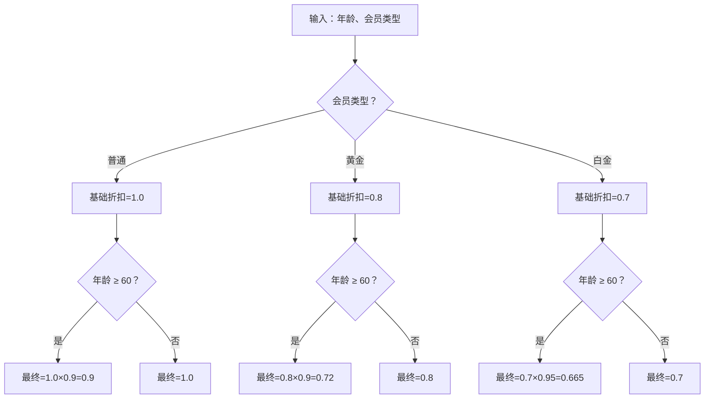

---

### 2.4 黑盒测试：只关心输入输出

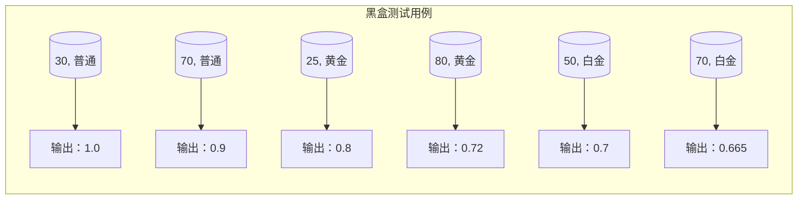

**黑盒测试的优点：**

- 测试用例直接来自需求（产品经理能看懂）
- 不依赖代码实现，重构后测试仍然有效
- 适合多AI协作：每个AI只需知道"输入输出契约"

**黑盒测试的局限：**

- 无法保证覆盖所有代码分支（比如上面的 else 分支可能没测到）

---

### 2.5 白盒测试：检查内部分支

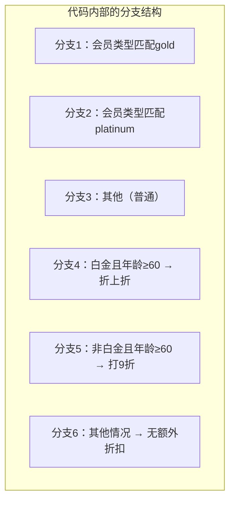

**白盒测试的目标**：确保每个分支都被执行过。

**要达到分支覆盖100%，需要至少以下测试用例：**

| 测试用例 | 覆盖的分支 |
|---------|-----------|
| (黄金, 30) | 分支1, 分支6 |
| (黄金, 70) | 分支1, 分支5 |
| (白金, 50) | 分支2, 分支6 |
| (白金, 70) | 分支2, 分支4 |
| (普通, 30) | 分支3, 分支6 |
| (普通, 70) | 分支3, 分支5 |

**注意**：黑盒测试的6个用例已经覆盖了所有分支！但白盒测试让我们有意识地检查是否遗漏。

---

### 2.6 覆盖率的三层含义

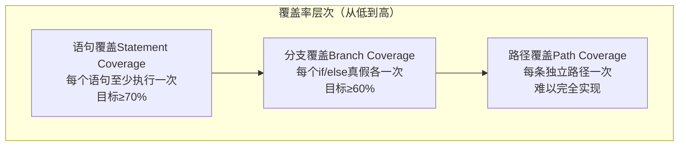

**一个重要的认识**：100%语句覆盖 ≠ 没有bug！

```mermaid
flowchart LR
    subgraph 举例[举例：除法函数]
        Code[if b == 0 { return error }<br/>else { return a/b }]
        Test[测试用例：(10, 2)] --> Cover[覆盖了else分支]
        Cover --> Bug[但从未测试b=0的情况]
    end
```

所以我们需要分支覆盖来检查所有条件。

---

### 2.7 覆盖率工具工作流程

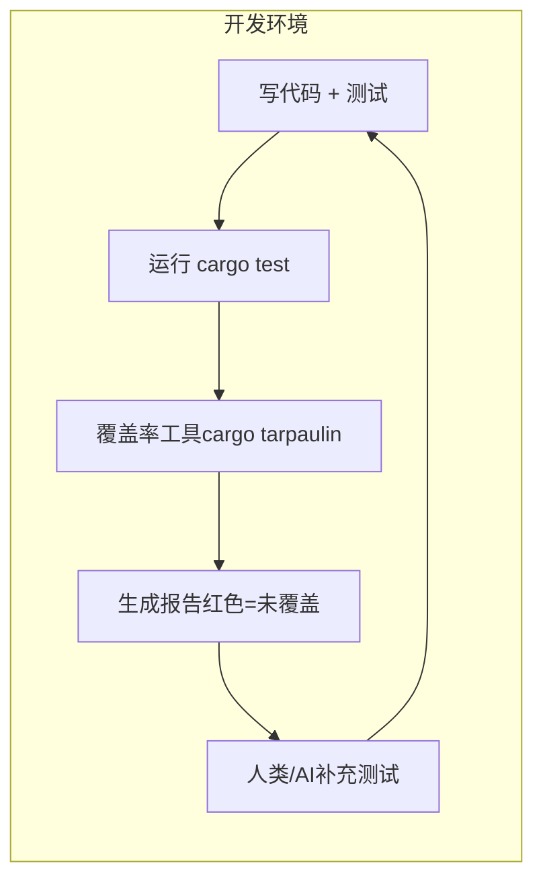

**实践命令**：

```bash
cargo tarpaulin --out Html --output-dir coverage
# 打开 coverage/index.html 查看红色行
```

---

## Part 3: 测试驱动开发（TDD）—— 红-绿-重构（第2周第1课）

---

### 3.1 TDD的核心循环

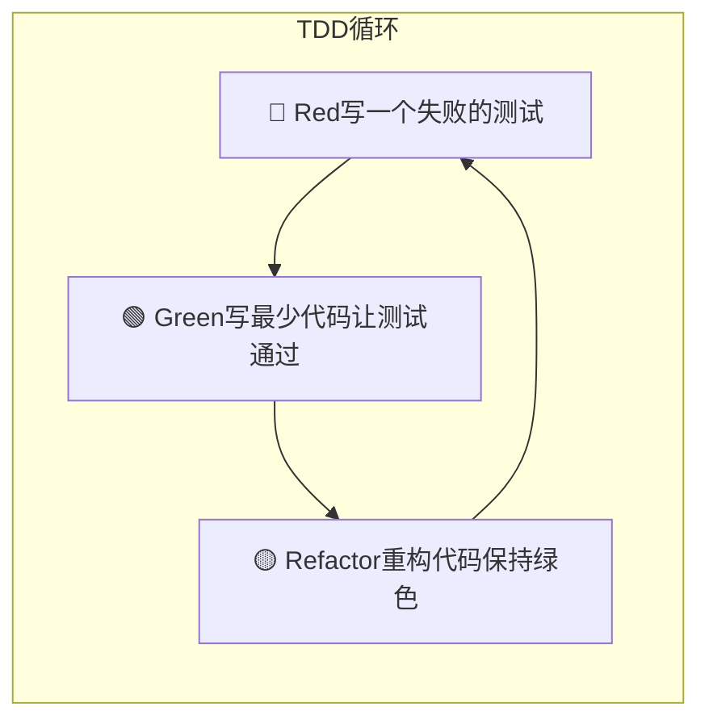

**三个状态的解释**：

- **Red**：测试失败（因为功能还没实现）
- **Green**：测试通过（功能已实现，可能很粗糙）
- **Refactor**：优化代码结构，不改变功能（测试仍然通过）

---

### 3.2 TDD完整流程 —— 泳道图

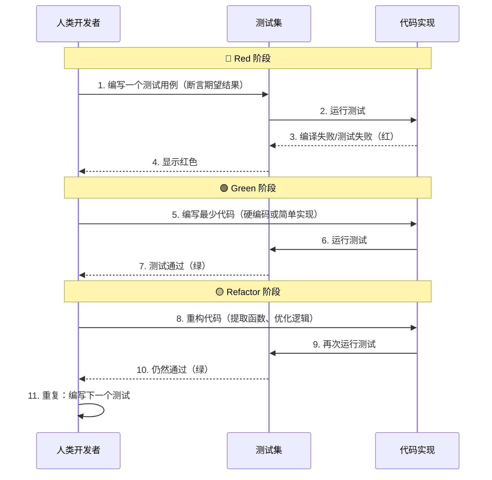

---

### 3.3 实例：用TDD开发"解析LIMIT子句" —— 泳道图详解

**需求**：解析 SQL 的 LIMIT 10，返回数字10。要求支持0、负数报错、无LIMIT返回None。

```mermaid
sequenceDiagram
    participant H as 人类/AI
    participant Test as 测试用例
    participant Code as 代码
    
    Note over H,Code: 第1轮：处理 LIMIT 10
    
    H->>Test: 写测试：parse_limit("LIMIT 10") 应返回 Some(10)
    Test->>Code: 运行测试
    Code-->>Test: 编译失败（函数不存在）→ 🔴
    H->>Code: 写最少代码：fn parse_limit() { return Some(10); }
    Code->>Test: 运行测试
    Test-->>H: 测试通过 → 🟢
    
    Note over H,Code: 第2轮：处理 LIMIT 0
    
    H->>Test: 添加测试：parse_limit("LIMIT 0") 应返回 Some(0)
    Test->>Code: 运行测试
    Code-->>Test: 失败（仍返回10）→ 🔴
    H->>Code: 改进代码：读取数字并返回
    Code->>Test: 运行测试
    Test-->>H: 两个测试都通过 → 🟢
    
    Note over H,Code: 第3轮：处理负数报错
    
    H->>Test: 添加测试：parse_limit("LIMIT -5") 应返回错误
    Test->>Code: 运行测试
    Code-->>Test: 失败（返回Some(-5)）→ 🔴
    H->>Code: 增加负数检查，返回错误
    Code->>Test: 运行测试
    Test-->>H: 所有测试通过 → 🟢
    
    Note over H,Code: 第4轮：重构
    
    H->>Code: 提取公共逻辑，改进错误信息
    Code->>Test: 运行所有测试
    Test-->>H: 仍然通过 → 🟢
```

---

### 3.4 为什么TDD对多AI协作特别重要？

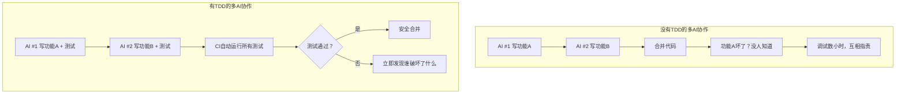

**核心价值**：

- 测试成为可执行的需求文档，AI之间不会误解
- 每个AI修改代码前必须保证所有测试通过
- 重构安全：有测试兜底，AI可以大胆优化

---

### 3.5 TDD vs 传统开发 —— 对比图

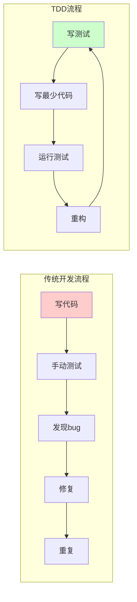

| 维度 | 传统开发 | TDD |
|------|---------|-----|
| 测试编写时机 | 事后（常常忘记） | 事前（强制编写） |
| 反馈周期 | 长（手动测试） | 短（自动化秒级反馈） |
| 重构信心 | 低（怕破坏功能） | 高（测试保护） |
| AI适用性 | AI容易写出"一次性代码" | AI被迫写出可测试代码 |

---

## Part 4: 软件治理与分支策略（第2周第2课）

---

### 4.1 多AI协作的完整治理体系

**核心理念**：规则不是建议，而是法律。

---

### 4.2 分支策略：让AI各走各的路

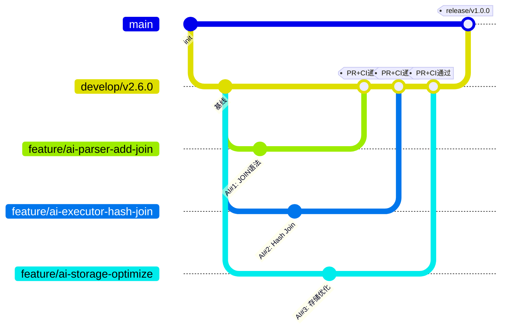

**分支命名规范**：

- `feature/ai-{模块名}-{功能描述}` —— 新功能
- `fix/ai-{模块名}-{问题描述}` —— Bug修复
- `refactor/ai-{模块名}-{改进内容}` —— 重构

---

### 4.3 分支保护规则（GitHub配置）

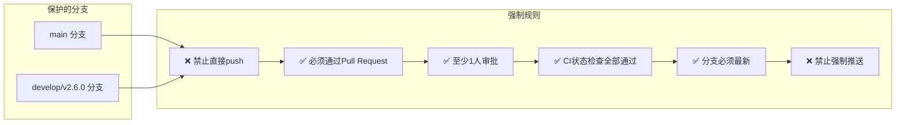

---

### 4.4 PR审查流程（带泳道）

```mermaid
sequenceDiagram
    participant AI as AI Agent
    participant Git as Git/GitHub
    participant CI as CI系统
    participant Human as 人类审查者
    
    AI->>Git: 1. 创建 feature/ai-xxx 分支
    AI->>Git: 2. 提交代码 + 测试
    AI->>Git: 3. 创建 Pull Request
    
    Git->>CI: 4. 触发 CI 自动检查
    CI->>CI: 5. 运行 cargo build/test/clippy/fmt/audit
    CI-->>Git: 6. 返回结果（通过/失败）
    
    alt CI 失败
        Git-->>AI: 7a. 标记 ❌，阻止合并
        AI->>AI: 8a. 修复问题，重新推送
    else CI 通过
        Git->>Human: 7b. 通知人类审查
        Human->>Human: 8b. 检查代码逻辑、命名，安全
        alt 审查不通过
            Human-->>AI: 9b. 提出修改意见
            AI->>AI: 10b. 修改并推送
        else 审查通过
            Human->>Git: 9c. 批准 PR
            Git->>Git: 10c. 合并到 develop
        end
    end
```

**AI代码审查清单（人类要检查的）**：

- ✅ 功能正确性（边界条件、错误处理）
- ✅ 代码质量（命名、重复代码）
- ✅ 测试覆盖（新代码有测试吗？）
- ✅ 安全（SQL注入？硬编码密码？）

---

### 4.5 CI/CD门禁 —— 自动法官

```mermaid
flowchart TD
    Start[开发者/AI 推送代码] --> PR[创建 Pull Request]
    PR --> CI[CI 自动运行]
    
    CI --> Check1[编译检查<br/>cargo build]
    Check1 -->|失败| Fail[❌ 阻止合并]
    Check1 -->|通过| Check2[单元测试<br/>cargo test]
    Check2 -->|失败| Fail
    Check2 -->|通过| Check3[代码质量<br/>cargo clippy]
    Check3 -->|有警告| Fail
    Check3 -->|通过| Check4[格式检查<br/>cargo fmt]
    Check4 -->|不匹配| Fail
    Check4 -->|通过| Check5[覆盖率<br/>≥70%?]
    Check5 -->|否| Fail
    Check5 -->|是| Check6[安全审计<br/>cargo audit]
    Check6 -->|有漏洞| Fail
    Check6 -->|通过| Pass[✅ 允许合并]
    
    Fail --> Fix[开发者/AI 修复]
    Fix --> PR
```

**门禁清单**：

| 检查项 | 命令 | 失败后果 |
|--------|------|---------|
| 编译 | cargo build | ❌ 阻止合并 |
| 测试 | cargo test | ❌ 阻止合并 |
| 代码质量 | cargo clippy | ❌ 阻止合并 |
| 格式 | cargo fmt --check | ❌ 阻止合并 |
| 覆盖率 | cargo tarpaulin --fail-under 70 | ❌ 阻止合并 |
| 安全 | cargo audit | ❌ 阻止合并 |

---

### 4.6 版本命名规范与发布流程

```mermaid
flowchart LR
    subgraph 版本阶段[版本演进]
        Dev[dev/v1.0.0-dev1<br/>开发中] --> Alpha[alpha/v1.0.0-alpha1<br/>内部测试]
        Alpha --> Beta[beta/v1.0.0-beta1<br/>公开测试]
        Beta --> RC[rc/v1.0.0-rc1<br/>候选发布]
        RC --> Release[release/v1.0.0<br/>正式发布]
    end
```

**为什么要规范版本？**

- 避免混乱：v1, v1.0, version1, final 让人困惑
- 明确质量阶段：alpha 表示可能还有bug，release 表示稳定
- 支持多AI并行：每个AI知道自己基于哪个基线开发

---

### 4.7 完整的多AI协作工作流

```mermaid
flowchart TD
    subgraph 人类职责[人类：设定规则]
        H1[定义分支策略]
        H2[配置CI门禁]
        H3[设定覆盖率目标]
        H4[审查关键PR]
    end
    
    subgraph AI职责[AI Agent：执行任务]
        A1[在feature分支开发]
        A2[编写测试（TDD）]
        A3[确保CI通过]
        A4[响应审查意见]
    end
    
    subgraph 自动化[自动化系统：强制执行]
        Auto1[GitHub Actions]
        Auto2[分支保护]
        Auto3[覆盖率检查]
        Auto4[安全扫描]
    end
    
    H1 --> A1
    H2 --> Auto1
    H3 --> Auto3
    A1 --> A2 --> A3 --> A4
    A3 --> Auto1
    Auto1 --> Auto2 --> Auto3 --> Auto4
```

---

## Part 5: 总结与后续课程呼应

---

### 5.1 核心思想总结

```mermaid
mindmap
    root((多AI协作的核心思想))
        测试是契约
            黑盒测试：定义外部行为
            白盒测试：保证内部完整
            TDD：测试驱动设计
        分支是隔离
            feature分支独立
            develop集成主线
            main正式发布
        CI是法官
            自动运行所有检查
            不通过不能合并
        强制统一标准
            人类是最终决策者
                架构设计
                安全审查
                质量把关
```

---

### 5.2 从Prompt到Harness的演进路径

```mermaid
flowchart LR
    subgraph 第1-6周[第1-6周：Prompt 时代]
        P1[提示词工程] --> P2[AI生成代码]
        P2 --> P3[人工审查]
    end
    
    subgraph 第7-8周[第7-8周：Context 时代]
        C1[提供项目上下文] --> C2[AI理解现有代码]
        C2 --> C3[风格一致但无强制]
    end
    
    subgraph 第9-16周[第9-16周：Harness 时代]
        H1[设定规则+门禁] --> H2[AI受约束工作]
        H2 --> H3[质量可控可规模]
    end
    
    第1-6周 --> 第7-8周 --> 第9-16周
```

**最终目标**：即使不懂具体的编程语言，也能通过"规则治理"开发出高质量的软件产品。

---

### 5.3 与第10-16讲的呼应

| 后续讲 | 内容 | 与本讲的关系 |
|--------|------|-------------|
| 第10讲 | PR工作流与项目成熟度评估 | 细化PR审查和成熟度度量 |
| 第11讲 | CI/CD与OpenClaw自动化 | 将Harness层自动化，编排多AI |
| 第12讲 | 性能优化与重构 | 在测试保护下进行安全重构 |
| 第13讲 | 安全扫描与审计 | 扩展Harness层，加入安全门禁 |
| 第14讲 | 发布门禁与检查清单 | 系统化门禁，形成发布标准 |
| 第15讲 | 版本发布与长期规划 | 基于版本规范进行多AI协作规划 |
| 第16讲 | 项目展示与职业发展 | 总结多AI协作经验 |

---

## 课后作业（2周4节课）

### 第1周第1课作业

1. 画出你所在项目的当前协作模式（是单点还是并行？）
2. 思考：如果让三个AI同时开发你的项目，最可能出现的冲突是什么？

### 第1周第2课作业

为下面的函数设计黑盒测试用例（至少5个）和分支覆盖测试用例：

```rust
fn can_vote(age: u32, citizenship: &str, registered: bool) -> bool {
    age >= 18 && citizenship == "US" && registered
}
```

解释为什么100%分支覆盖仍然可能遗漏bug。

### 第2周第1课作业

用TDD方式开发一个 `parse_order_by` 函数（解析 ORDER BY 子句）。要求：

- 支持 ORDER BY name ASC
- 支持 ORDER BY age DESC
- 支持多个字段：ORDER BY name ASC, age DESC

画出红-绿-重构的泳道图

### 第2周第2课作业

1. 为你的项目设计分支策略（画出gitGraph图）
2. 配置GitHub分支保护规则（至少3条）
3. 创建一个PR，观察CI门禁运行，截图报告

---

<!-- _class: lead -->

# 谢谢！

## 下节课：PR工作流与项目成熟度评估

**核心思想**：用测试保护协作，用治理实现规模，用TDD驯服AI

---
