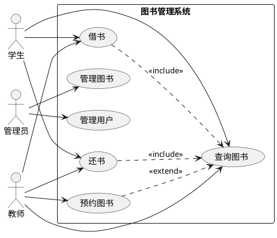

# 第3周：面向对象分析与设计实践

> 实验时间：2学时  
> 实验类型：设计性  
> 前置知识：第三讲 - 面向对象分析与设计原理

---

## 一、实验目标

- [ ] 掌握面向对象分析（OOA）的基本方法：识别对象、属性和关系
- [ ] 掌握面向对象设计（OOD）的基本方法：定义类、接口和关系
- [ ] 能够使用AI辅助生成用例图、类图
- [ ] 能够使用Builder模式生成代码框架
- [ ] 理解SOLID原则在设计中的应用

---

## 二、知识回顾：面向对象分析与设计

### 2.1 OOA的核心任务

- **对象发现**：从需求中提取名词，识别候选对象
- **关系识别**：关联、聚合、组合、泛化
- **行为识别**：对象需要提供哪些服务

### 2.2 OOD的核心任务

- **类的定义**：属性、方法、可见性
- **关系设计**：关联方向、多重性、生命周期
- **接口设计**：抽象与实现分离
- **设计原则**：SOLID原则的应用

### 2.3 UML图在OOAD中的作用

| 图类型 | 用途 | 在AI时代的作用 |
|--------|------|----------------|
| 用例图 | 描述系统功能与参与者 | 快速沟通需求，AI可自动生成 |
| 类图 | 描述系统的静态结构 | 核心设计文档，AI可生成代码框架 |
| 对象图 | 描述某一时刻的对象快照 | 辅助理解实例关系 |

---

## 三、操作步骤

### 步骤1：使用AI生成用例图（20分钟）

#### 1.1 系统描述

我们以**图书管理系统**为例进行面向对象建模。

> **系统需求**：  
> - 学生可以查询图书、借书、还书  
> - 教师除学生权限外，还可以预约图书  
> - 管理员可以管理图书（增删改查）、管理用户（增删改查）  
> - 系统需要记录借阅历史  

#### 1.2 在Trae IDE中生成用例图

打开Trae IDE，在AI对话窗口输入：

```
请为"图书管理系统"生成用例图，使用PlantUML语法。

参与者：学生、教师、管理员

用例：
- 学生：查询图书、借书、还书
- 教师：查询图书、借书、还书、预约图书
- 管理员：管理图书、管理用户

包含关系：借书需要先查询图书，还书需要先查询借阅记录
扩展关系：预约图书可扩展自查询图书

请输出PlantUML代码。
```

#### 1.3 查看生成的代码并渲染

AI会输出类似以下的PlantUML代码：



将代码复制到PlantUML在线编辑器或本地工具中查看图形。

**✅ 检查点1：截图保存用例图**

---

### 步骤2：对象发现（15分钟）

#### 2.1 使用AI辅助识别候选对象

在AI对话中输入：

```
请分析"图书管理系统"的需求，识别出候选对象（名词），并分类为实体对象、边界对象、控制对象。

需求：
- 学生可以查询图书、借书、还书
- 教师除学生权限外，还可以预约图书
- 管理员可以管理图书（增删改查）、管理用户（增删改查）
- 系统需要记录借阅历史
```

#### 2.2 AI生成的对象列表示例

| 候选对象 | 类型 | 说明 |
|----------|------|------|
| 学生 | 实体 | 系统用户的一种 |
| 教师 | 实体 | 系统用户的一种 |
| 管理员 | 实体 | 系统用户的一种 |
| 图书 | 实体 | 核心业务对象 |
| 借阅记录 | 实体 | 记录借还历史 |
| 预约记录 | 实体 | 记录预约信息 |
| 借书界面 | 边界 | 与用户交互的界面 |
| 图书管理界面 | 边界 | 管理员界面 |
| 借书控制器 | 控制 | 处理借书逻辑 |
| 还书控制器 | 控制 | 处理还书逻辑 |

**✅ 检查点2：保存对象列表**

---

### 步骤2-1：从用例图到顺序图的过渡（20分钟）

> **为什么需要顺序图？**  
> 用例图只告诉我们"做什么"（What），但不知道"怎么做"（How）和"谁来做"（Who）。顺序图揭示对象间的消息传递、时间顺序、激活周期，帮助识别缺失的对象或职责。

#### 2-1.1 用例图与顺序图的对比

| 用例图 | 顺序图 |
|--------|--------|
| 描述系统功能 | 描述对象交互 |
| 参与者与用例的关系 | 对象之间如何通信 |
| 静态视图 | 动态视图 |
| "谁可以做什么" | "做了什么之后谁响应" |

#### 2-1.2 借书用例的流程细化

以"借书"用例为例，分析其详细步骤：

```
借书流程活动图：

   ┌──────────┐     ┌──────────┐     ┌──────────┐     ┌──────────┐
   │  用户登录  │ ──▶ │ 查询图书  │ ──▶ │ 选择图书  │ ──▶ │ 检查库存  │
   └──────────┘     └──────────┘     └──────────┘     └──────────┘
                                                         │
                                                         ▼
   ┌──────────┐     ┌──────────┐     ┌──────────┐     ┌──────────┐
   │ 返回结果  │ ◀── │ 记录借阅  │ ◀── │ 检查用户  │ ◀── │ 检查预约  │
   └──────────┘     └──────────┘     └──────────┘     └──────────┘
```

#### 2-1.3 识别顺序图中的关键对象

基于用例图中的"借书"用例，使用AI识别需要哪些对象参与：

```
请分析"借书"用例，识别顺序图中的参与对象。

要求：
1. 从用例图中提取"借书"相关的参与者
2. 识别需要哪些业务对象（实体）
3. 识别需要哪些服务对象（控制）
4. 识别需要哪些数据访问对象

用例：借书
包含关系：借书需要先查询图书（<<include>>）
扩展关系：预约图书可扩展借书（<<extend>>）
```

#### 2-1.4 AI识别的对象列表

| 对象 | 类型 | 职责 | 关键属性 |
|------|------|------|----------|
| User | 实体 | 代表借阅者 | id, name, type, maxBorrowLimit |
| Book | 实体 | 图书信息 | isbn, title, author |
| BookCopy | 实体 | 图书副本/库存 | copyId, status, location |
| BorrowRecord | 实体 | 借阅记录 | recordId, borrowDate, dueDate |
| Reservation | 实体 | 预约记录 | reservationId, userId, copyId |
| BorrowController | 控制 | 处理借书请求 | 接收请求，调度业务 |
| BookService | 控制 | 图书业务逻辑 | 查询、检查、确认 |
| UserService | 控制 | 用户业务逻辑 | 验证、权限检查 |
| Repository | 数据 | 数据持久化 | 增删改查 |

**💡 关键设计决策：为什么需要 BookCopy 而不是直接用 Book？**

```
一本书《Python编程》可以有 5 本副本（复本）：
- 副本1: 已在借
- 副本2: 可借
- 副本3: 已预约
- 副本4: 正在维修
- 副本5: 可借

如果只用一个 Book 对象，无法精确管理每本书的状态！
BookCopy（副本）代表具体的物理书籍，是借阅的最小单位。
```

#### 2-1.5 使用AI生成借书流程顺序图

在AI对话中输入：

```
请为"图书管理系统"的"借书"用例生成顺序图，使用Mermaid语法。

参与者：
- User (学生/教师)
- BorrowController (借书控制器)
- BookService (图书服务)
- UserService (用户服务)
- BookCopy (图书副本)
- BorrowRepository (借阅仓储)
- Reservation (预约记录)

流程步骤：
1. 用户发起借书请求 (userId, copyId)
2. 控制器验证用户有效性
3. 控制器检查用户借阅数量是否已达上限
4. 控制器查询图书副本状态
5. 如果图书已借出，检查是否有当前用户的预约
6. 如果有预约或图书可借，更新副本状态为"已借"
7. 创建借阅记录
8. 返回借书结果

需要体现：
- alt 条件分支（用户无效/已达上限/图书状态检查）
- activate/deactivate 激活条
- 返回消息
```

#### 2-1.6 AI生成的顺序图示例

```mermaid
sequenceDiagram
    participant U as User (学生/教师)
    participant BC as BorrowController
    participant BS as BookService
    participant UR as UserRepository
    participant BR as BorrowRepository
    participant BCopy as BookCopy
    participant Res as Reservation

    U->>BC: requestBorrow(userId, bookCopyId)
    activate BC

    BC->>UR: getUserById(userId)
    UR-->>BC: User
    deactivate UR

    alt 用户不存在或已冻结
        BC-->>U: 返回错误: 用户无效
    else 用户有效
        BC->>BR: checkBorrowLimit(userId)
        BR-->>BC: currentCount

        alt 已达借阅上限
            BC-->>U: 返回错误: 借阅数量已达上限
        else 未达上限
            BC->>BS: getBookCopyById(bookCopyId)
            BS-->>BC: BookCopy

            alt 图书状态 != 可借
                BC->>BS: checkReservation(bookCopyId, userId)
                BS-->>BC: hasReservation

                alt 有预约且当前用户预约
                    BC->>BS: confirmBorrow(copyId)
                    BS->>BCopy: updateStatus(已借)
                    BC->>BR: createBorrowRecord()
                    BC-->>U: 返回成功: 借阅成功
                else 无预约或非当前用户预约
                    BC-->>U: 返回错误: 图书已借出/已预约
                end
            else 图书可借
                BC->>BS: confirmBorrow(copyId)
                BS->>BCopy: updateStatus(已借)
                BC->>BR: createBorrowRecord()
                BC-->>U: 返回成功: 借阅成功
            end
        end
    end
    deactivate BC
```

**✅ 检查点2-1：截图保存顺序图**

#### 2-1.7 顺序图到类图的设计映射

顺序图揭示了对象之间的交互，设计类图时需要：

| 顺序图中的角色 | 类图中的设计 | 设计原则 |
|---------------|--------------|----------|
| BorrowController | Controller 类 | 单一职责：处理请求 |
| BookService/UserService | Service 类 | 业务逻辑封装 |
| Repository 接口 | Repository 接口 | 依赖倒置，便于测试 |
| User/BookCopy/BorrowRecord | Entity 类 | 领域对象 |

**分层架构设计：**

```
┌─────────────────────────────────────────────────────┐
│  Presentation Layer (表现层)                        │
│  BorrowController - 处理HTTP请求/参数校验/响应       │
└─────────────────────────────────────────────────────┘
                         │
                         ▼
┌─────────────────────────────────────────────────────┐
│  Business Layer (业务逻辑层)                        │
│  BorrowService / BookService / UserService          │
│  - 核心业务逻辑                                      │
│  - 事务管理                                          │
│  - 业务规则验证                                      │
└─────────────────────────────────────────────────────┘
                         │
                         ▼
┌─────────────────────────────────────────────────────┐
│  Data Access Layer (数据访问层)                     │
│  Repository 接口 - 数据持久化/数据库操作            │
└─────────────────────────────────────────────────────┘
```

**✅ 检查点2-2：记录OOA到OOD的转换要点**

---

### 步骤3：使用AI生成类图（25分钟）

#### 3.1 基于顺序图生成类图

顺序图完成后，可以基于顺序图中的对象交互来设计类图。输入：

```
请基于以下顺序图生成类图，使用Mermaid语法。

顺序图揭示的对象：
- BorrowController: 处理借书请求
- BookService: 图书业务逻辑
- UserService: 用户业务逻辑  
- UserRepository: 用户数据访问
- BookCopyRepository: 图书副本数据访问
- BorrowRecordRepository: 借阅记录数据访问

实体类：
- User: id, name, user_type, max_borrow_limit, status
- BookCopy: copy_id, book_id, status, location
- BorrowRecord: record_id, user_id, copy_id, borrow_date, due_date, return_date, status
- Reservation: reservation_id, user_id, copy_id, reservation_date, status

枚举：
- UserType: STUDENT, TEACHER
- CopyStatus: AVAILABLE, BORROWED, RESERVED, LOST
- RecordStatus: BORROWING, RETURNED, OVERDUE

要求：
- 使用Repository接口（依赖倒置原则）
- 体现分层架构：Controller -> Service -> Repository
- 标注可见性（+ public, - private）
- 体现泛化关系（继承）
- 体现依赖关系（Controller依赖Service，Service依赖Repository）
```

在AI对话中输入：

```
请为"图书管理系统"生成类图，使用PlantUML语法。

基于以下对象：
- 用户（User）作为抽象类，包含属性：用户ID、姓名、类型
- 学生（Student）继承User
- 教师（Teacher）继承User，增加属性：可预约数量
- 管理员（Admin）继承User
- 图书（Book）：图书ID、书名、作者、ISBN、状态（可借/已借）
- 借阅记录（BorrowRecord）：记录ID、用户ID、图书ID、借书日期、应还日期、实际还书日期
- 预约记录（Reservation）：记录ID、用户ID、图书ID、预约日期、状态

关系：
- User与BorrowRecord是一对多
- Book与BorrowRecord是一对多
- User与Reservation是一对多（教师可用）
- Book与Reservation是一对多
- 学生和教师继承User

标注可见性（+ public, - private）和多重性。
```

#### 3.2 审查和优化

- 检查是否有缺失的属性和方法
- 确认关系是否正确（聚合/组合、多重性）
- 可以要求AI添加缺失的关联，例如"Book和BorrowRecord应该有关联"

**✅ 检查点3：截图保存类图**

---

### 步骤4：数据字典设计（15分钟）

#### 4.1 使用AI生成数据字典

在AI对话中输入：

```
请为"图书管理系统"生成数据字典，包括以下表的字段定义：
- 用户表（user）
- 图书表（book）
- 借阅记录表（borrow_record）
- 预约记录表（reservation）

用表格形式输出，包含字段名、数据类型、说明、主键/外键。
```

**✅ 检查点4：保存数据字典**

---

### 步骤5：使用Builder模式生成代码框架（20分钟）

#### 5.1 切换到Builder模式

在Trae中点击Builder模式或输入 `/builder`

#### 5.2 输入生成指令

```
请基于类图生成Rust代码框架，要求：
- 定义User trait和Student、Teacher、Admin结构体
- 定义Book结构体
- 定义BorrowRecord结构体
- 定义Reservation结构体
- 为每个结构体实现new方法和基本的getter/setter
- 使用模块组织代码
```

#### 5.3 查看生成的代码框架

AI会生成类似以下结构的代码：

```rust
// lib.rs 或 main.rs
mod models;

// models/mod.rs
pub mod user;
pub mod book;
pub mod borrow;
pub mod reservation;
```

每个模块包含结构体定义和impl块。

#### 5.4 保存代码到项目

将生成的代码保存到 `src/models/` 目录下。

**✅ 检查点5：保存生成的代码框架**

---

### 步骤6：Git提交（10分钟）

#### 6.1 创建分支

```bash
git checkout -b docs/ooad-图书管理系统-你的学号
```

#### 6.2 创建文档目录

```bash
mkdir -p docs/ooad/book-system
```

#### 6.3 保存所有生成的内容

- 用例图截图
- 类图截图
- 对象列表
- 数据字典
- 代码框架

#### 6.4 提交

```bash
git add docs/ooad/book-system/
git commit -m "docs: add OOAD for book system

- use case diagram
- class diagram
- object list
- data dictionary
- code skeleton"
```

#### 6.5 推送

```bash
git push origin docs/ooad-图书管理系统-你的学号
```

**✅ 检查点6：截图Git提交记录**

---

## 四、实验报告

### 4.1 报告内容

1. 用例图（截图 + 说明）
2. 对象发现列表（表格）
3. **顺序图：从用例图到顺序图的过渡分析**
4. **顺序图说明：OOA到OOD的转换要点**
5. 类图（截图 + 说明）
6. 数据字典（表格）
7. 代码框架（关键代码片段）
8. Git提交截图
9. AI实践心得：描述使用AI工具生成UML和代码的体验

### 4.2 报告新增内容说明

#### 4.2.1 顺序图分析要点

在报告中需要阐述以下内容：

1. **为什么需要从用例图过渡到顺序图？**
   - 用例图描述"谁可以做什么"（静态视图）
   - 顺序图描述"做了什么之后谁响应"（动态视图）
   - 用例图只说"借书"，顺序图揭示"如何借"

2. **如何从用例图识别顺序图对象？**
   - 从参与者映射到实体对象（User）
   - 从用例映射到服务对象（Service/Controller）
   - 从包含关系识别数据访问对象（Repository）

3. **OOA到OOD的转换**
   - 顺序图中的对象 → 类图中的类
   - 消息传递 → 方法调用
   - 激活周期 → 对象的生命周期

#### 4.2.2 关键设计决策说明

在报告中需要解释以下设计决策：

- 为什么区分 Book 和 BookCopy？
- 为什么使用 Repository 接口？
- 为什么采用分层架构？

### 4.3 提交方式

```bash
mkdir -p reports/week-03
# 将报告放入该目录
git add reports/week-03/
git commit -m "experiment: submit week-03 report"
git push
```

---

## 五、评分标准

| 检查项 | 分值 |
|--------|------|
| 用例图正确完整 | 15分 |
| 对象发现合理 | 10分 |
| 类图正确完整（包含类、关系、多重性） | 25分 |
| 数据字典规范 | 15分 |
| 代码框架生成正确 | 15分 |
| Git提交规范 | 10分 |
| AI实践心得 | 10分 |

---

## 六、AI工具使用技巧总结

### 6.1 有效Prompt要素

- ✅ 明确系统范围和功能
- ✅ 提供实体和关系的自然语言描述
- ✅ 指定输出格式（PlantUML、Mermaid、表格、代码）
- ✅ 要求标注可见性、多重性等细节

### 6.2 常用Prompt模板

**生成用例图**：
```
请为[系统名]生成用例图，使用PlantUML。
参与者：[...]
用例：[...]
包含/扩展关系：[...]
```

**生成类图**：
```
请为[系统名]生成类图，使用PlantUML。
类包括：[...]
属性：[...]
方法：[...]
关系：[...]
标注可见性和多重性。
```

**生成数据字典**：
```
请为[系统名]生成数据字典，表格形式，包含表名、字段名、类型、说明、约束。
```

### 6.3 迭代优化技巧

- 如果AI生成的图不完整，可以补充描述重新生成
- 要求AI添加缺失的属性和方法
- 询问AI是否符合SOLID原则，并请其改进

---

## 七、课后思考

1. 如何判断一个类是实体类、边界类还是控制类？
2. 为什么需要先建模再编码？AI时代是否还需要建模？
3. 如何确保AI生成的类图符合SOLID原则？
4. 类图中的聚合和组合在实际代码中如何体现？

---

**实验完成日期**: ____________

**得分**: ____________

**助教签名**: ____________
