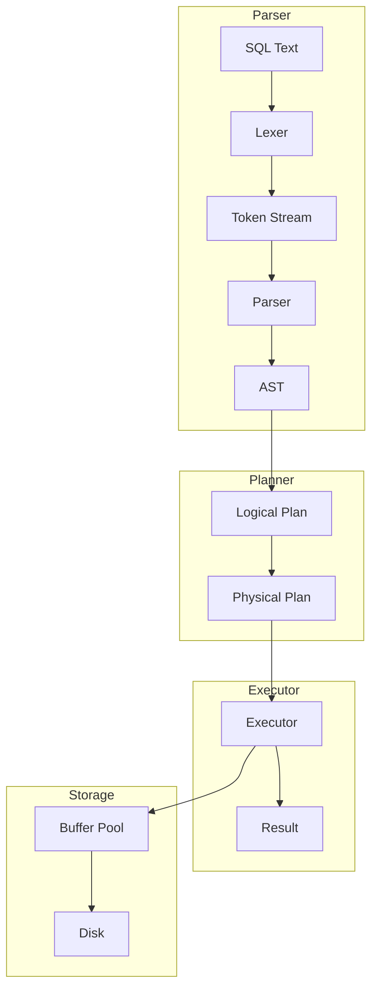

# AI增强的软件工程 - 上机实验指导书

## 实验基本信息

| 项目 | 内容 |
|------|------|
| **课程名称** | AI增强的软件工程 |
| **实验学时** | 32学时（16周 × 2学时） |
| **实验类型** | 验证性 + 设计性 + 综合性 |
| **实验项目** | SQLRustGo |

---

## 实验一：开发环境搭建（第1周）

### 实验目的

1. 掌握Rust开发环境的安装和配置
2. 掌握Git版本控制工具的配置
3. 掌握TRAE IDE的安装和使用
4. 能够克隆并运行SQLRustGo项目

### 实验环境

- 操作系统：macOS / Linux / Windows 10+
- 网络环境：能够访问GitHub
- 硬件要求：8GB+ 内存，20GB+ 硬盘空间

### 实验内容

#### 任务1：安装Rust工具链（20分钟）

```bash
# 1. 安装Rust
curl --proto '=https' --tlsv1.2 -sSf https://sh.rustup.rs | sh

# 2. 配置环境变量
source $HOME/.cargo/env

# 3. 验证安装
rustc --version
cargo --version

# 4. 安装额外组件
rustup component add clippy rustfmt
```

#### 任务2：配置Git和SSH（20分钟）

```bash
# 1. 配置Git用户信息
git config --global user.name "Your Name"
git config --global user.email "your@email.com"

# 2. 生成SSH密钥
ssh-keygen -t ed25519 -C "your@email.com"

# 3. 查看公钥
cat ~/.ssh/id_ed25519.pub

# 4. 添加SSH密钥到GitHub
# 访问 GitHub -> Settings -> SSH and GPG keys -> New SSH key

# 5. 验证SSH连接
ssh -T git@github.com
```

#### 任务3：安装TRAE IDE（15分钟）

1. 下载TRAE IDE安装包
2. 安装并启动TRAE IDE
3. 登录账号
4. 配置Rust插件

#### 任务4：克隆项目并运行（25分钟）

```bash
# 1. 克隆项目
git clone git@github.com:minzuuniversity/sqlrustgo.git

# 2. 进入项目目录
cd sqlrustgo

# 3. 构建项目
cargo build

# 4. 运行测试
cargo test

# 5. 运行代码检查
cargo clippy

# 6. 格式化代码
cargo fmt
```

### 实验要求

1. 完成所有安装步骤
2. 项目能够成功构建
3. 所有测试通过
4. 提交实验报告

### 实验报告内容

1. 环境信息截图
   - Rust版本截图
   - Git配置截图
   - TRAE IDE界面截图
2. 项目运行截图
   - cargo build 成功截图
   - cargo test 通过截图
3. 遇到的问题和解决方法

---

## 实验二：需求文档编写（第2周）

### 实验目的

1. 掌握需求分析的基本方法
2. 能够使用AI辅助进行需求分析
3. 能够编写需求规格说明书
4. 能够创建用户故事

### 实验内容

#### 任务1：使用AI分析需求（25分钟）

1. 打开TRAE IDE
2. 输入需求描述
3. 分析AI输出
4. 记录分析结果

#### 任务2：编写需求规格说明书（30分钟）

创建 `docs/requirements/requirements.md` 文件，包含：

```markdown
# 需求规格说明书

## 1. 项目背景

## 2. 功能需求

### 2.1 SQL解析功能
### 2.2 查询执行功能
### 2.3 数据存储功能

## 3. 非功能需求

### 3.1 性能要求
### 3.2 可靠性要求
### 3.3 可扩展性要求

## 4. 需求优先级

## 5. 验收标准
```

#### 任务3：创建用户故事（20分钟）

创建 `docs/requirements/user-stories.md` 文件：

```markdown
# 用户故事

## US-001: 执行SELECT查询
作为 用户
我想要 执行SELECT查询语句
以便于 从数据库中检索数据

验收标准：
- 支持基本的SELECT语句
- 支持WHERE条件
- 支持ORDER BY排序

## US-002: 执行INSERT操作
...

## US-003: 执行UPDATE操作
...

## US-004: 执行DELETE操作
...
```

#### 任务4：Git提交（15分钟）

```bash
git checkout -b docs/requirements
git add docs/requirements/
git commit -m "docs: add requirements document"
git push origin docs/requirements
```

### 实验要求

1. 需求文档结构完整
2. 用户故事符合规范
3. Git提交规范

---

## 实验三：架构设计实践（第3周）

### 实验目的

1. 掌握系统设计的基本方法
2. 能够使用AI辅助进行架构设计
3. 能够绘制架构图
4. 能够编写设计文档

### 实验内容

#### 任务1：使用AI设计模块（25分钟）

#### 任务2：绘制架构图（25分钟）

使用Mermaid绘制架构图：



#### 任务3：编写设计文档（25分钟）

创建 `docs/design/architecture.md` 文件

#### 任务4：Git提交（15分钟）

---

## 实验四：解析器开发（第4周）

### 实验目的

1. 理解词法分析原理
2. 理解语法分析原理
3. 能够使用AI辅助开发解析器
4. 能够编写测试用例

### 实验内容

#### 任务1：实现Token定义（20分钟）

```rust
// src/parser/token.rs

#[derive(Debug, Clone, PartialEq)]
pub enum Token {
    // 关键字
    Select,
    From,
    Where,
    Insert,
    Into,
    Values,
    Update,
    Set,
    Delete,
    
    // 标识符和字面量
    Identifier(String),
    String(String),
    Number(f64),
    
    // 运算符
    Plus,
    Minus,
    Star,
    Slash,
    Equal,
    NotEqual,
    Less,
    Greater,
    
    // 分隔符
    LeftParen,
    RightParen,
    Comma,
    Semicolon,
    
    // 特殊
    EOF,
}
```

#### 任务2：实现词法分析器（30分钟）

```rust
// src/parser/lexer.rs

pub struct Lexer {
    input: Vec<char>,
    position: usize,
}

impl Lexer {
    pub fn new(input: &str) -> Self {
        Self {
            input: input.chars().collect(),
            position: 0,
        }
    }
    
    pub fn next_token(&mut self) -> Token {
        // 实现词法分析逻辑
    }
}
```

#### 任务3：实现语法分析器（25分钟）

```rust
// src/parser/parser.rs

pub struct Parser {
    lexer: Lexer,
    current_token: Token,
}

impl Parser {
    pub fn new(lexer: Lexer) -> Self {
        // 实现语法分析逻辑
    }
    
    pub fn parse(&mut self) -> Result<Statement, ParseError> {
        // 实现解析逻辑
    }
}
```

#### 任务4：编写测试（15分钟）

```rust
#[cfg(test)]
mod tests {
    use super::*;
    
    #[test]
    fn test_lexer_select() {
        let mut lexer = Lexer::new("SELECT * FROM users");
        assert_eq!(lexer.next_token(), Token::Select);
        assert_eq!(lexer.next_token(), Token::Star);
        assert_eq!(lexer.next_token(), Token::From);
        assert_eq!(lexer.next_token(), Token::Identifier("users".to_string()));
    }
}
```

---

## 实验五：执行器开发（第5周）

### 实验目的

1. 理解查询执行模型
2. 能够设计执行器接口
3. 能够实现基本执行器
4. 能够编写测试用例

### 实验内容

#### 任务1：定义执行器接口（20分钟）

```rust
// src/executor/mod.rs

pub trait Executor {
    fn execute(&mut self) -> Result<ResultSet, ExecuteError>;
    fn schema(&self) -> &Schema;
}
```

#### 任务2：实现TableScan执行器（25分钟）

#### 任务3：实现Filter执行器（25分钟）

#### 任务4：编写测试（20分钟）

---

## 实验六：存储引擎开发（第6周）

### 实验目的

1. 理解存储引擎架构
2. 能够实现页结构
3. 能够实现缓冲区管理器
4. 能够实现数据持久化

### 实验内容

#### 任务1：实现页结构（25分钟）

```rust
// src/storage/page.rs

pub const PAGE_SIZE: usize = 4096;

pub struct Page {
    data: [u8; PAGE_SIZE],
    page_id: PageId,
    is_dirty: bool,
}
```

#### 任务2：实现缓冲区管理器（30分钟）

#### 任务3：实现数据持久化（25分钟）

#### 任务4：编写测试（20分钟）

---

## 实验七：测试用例编写（第7周）

### 实验目的

1. 掌握Rust测试框架
2. 能够使用AI生成测试用例
3. 能够提高测试覆盖率
4. 能够生成测试报告

### 实验内容

#### 任务1：分析测试覆盖率（15分钟）

```bash
cargo tarpaulin --out Html
```

#### 任务2：使用AI生成测试（30分钟）

#### 任务3：补充测试用例（30分钟）

#### 任务4：验证覆盖率（15分钟）

---

## 实验八：代码重构实践（第8周）

### 实验目的

1. 掌握代码重构原则
2. 能够识别代码异味
3. 能够使用AI辅助重构
4. 能够运行代码检查

### 实验内容

#### 任务1：运行Clippy检查（15分钟）

```bash
cargo clippy -- -W clippy::all
```

#### 任务2：使用AI识别重构点（20分钟）

#### 任务3：执行重构（35分钟）

#### 任务4：验证重构结果（20分钟）

---

## 实验九：分支保护配置（第9周）

### 实验目的

1. 理解Git分支策略
2. 能够配置分支保护规则
3. 理解多AI协同机制
4. 能够创建功能分支

### 实验内容

#### 任务1：创建开发分支（15分钟）

#### 任务2：配置分支保护规则（25分钟）

#### 任务3：测试保护规则（20分钟）

#### 任务4：创建功能分支（20分钟）

---

## 实验十：PR流程实践（第10周）

### 实验目的

1. 掌握PR工作流程
2. 能够进行代码审核
3. 能够处理合并冲突
4. 能够合并代码

### 实验内容

#### 任务1：创建功能分支（15分钟）

#### 任务2：实现功能并提交（25分钟）

#### 任务3：创建PR（15分钟）

#### 任务4：审核并合并（25分钟）

---

## 实验十一：CI流水线配置（第11周）

### 实验目的

1. 理解CI/CD原理
2. 能够配置GitHub Actions
3. 能够配置测试自动化
4. 能够配置覆盖率报告

### 实验内容

#### 任务1：创建Workflow文件（20分钟）

```yaml
# .github/workflows/ci.yml
name: CI

on:
  push:
    branches: [ main, alpha, beta, rc/* ]
  pull_request:
    branches: [ main ]

jobs:
  test:
    runs-on: ubuntu-latest
    steps:
      - uses: actions/checkout@v4
      - uses: actions-rust-lang/setup-rust-toolchain@v1
      - run: cargo test
      - run: cargo clippy
```

#### 任务2：配置测试自动化（20分钟）

#### 任务3：配置代码检查（20分钟）

#### 任务4：验证CI运行（20分钟）

---

## 实验十二：安全扫描实践（第12周）

### 实验目的

1. 理解软件安全基础
2. 能够运行依赖安全扫描
3. 能够运行代码安全扫描
4. 能够生成安全报告

### 实验内容

#### 任务1：运行cargo audit（20分钟）

```bash
cargo install cargo-audit
cargo audit
```

#### 任务2：配置Dependabot（20分钟）

#### 任务3：运行代码安全扫描（20分钟）

#### 任务4：生成安全报告（20分钟）

---

## 实验十三：门禁脚本编写（第13周）

### 实验目的

1. 理解发布门禁概念
2. 能够设计门禁检查
3. 能够编写门禁脚本
4. 能够创建检查清单

### 实验内容

#### 任务1：设计门禁检查（20分钟）

#### 任务2：编写门禁脚本（30分钟）

#### 任务3：创建检查清单（20分钟）

#### 任务4：测试门禁流程（20分钟）

---

## 实验十四：文档编写实践（第14周）

### 实验目的

1. 理解文档体系设计
2. 能够使用AI生成文档
3. 能够使用mdBook构建文档
4. 能够发布文档网站

### 实验内容

#### 任务1：编写API文档（25分钟）

#### 任务2：编写用户手册（25分钟）

#### 任务3：构建文档网站（20分钟）

#### 任务4：发布文档（20分钟）

---

## 实验十五：发布流程实践（第15周）

### 实验目的

1. 理解版本发布流程
2. 能够创建版本标签
3. 能够创建GitHub Release
4. 能够编写Release Notes

### 实验内容

#### 任务1：执行发布检查（20分钟）

#### 任务2：创建版本标签（15分钟）

```bash
git tag -a v1.0.0 -m "Release v1.0.0"
git push origin v1.0.0
```

#### 任务3：创建GitHub Release（25分钟）

#### 任务4：编写Release Notes（20分钟）

---

## 实验十六：项目答辩（第16周）

### 实验目的

1. 能够演示项目成果
2. 能够讲解技术实现
3. 能够回答技术问题
4. 能够总结学习心得

### 实验内容

#### 任务1：准备演示材料（20分钟）

#### 任务2：项目演示（40分钟）

#### 任务3：问题回答（20分钟）

#### 任务4：提交项目报告（20分钟）

---

## 实验考核标准

| 实验项目 | 考核内容 | 分值 |
|----------|----------|------|
| 实验一 | 环境搭建完成度 | 5分 |
| 实验二 | 需求文档质量 | 5分 |
| 实验三 | 设计文档质量 | 5分 |
| 实验四 | 解析器实现 | 10分 |
| 实验五 | 执行器实现 | 10分 |
| 实验六 | 存储引擎实现 | 10分 |
| 实验七 | 测试覆盖率 | 10分 |
| 实验八 | 代码质量 | 5分 |
| 实验九-十六 | 流程实践 | 40分 |

---

**制定时间**: 2026-02-22
