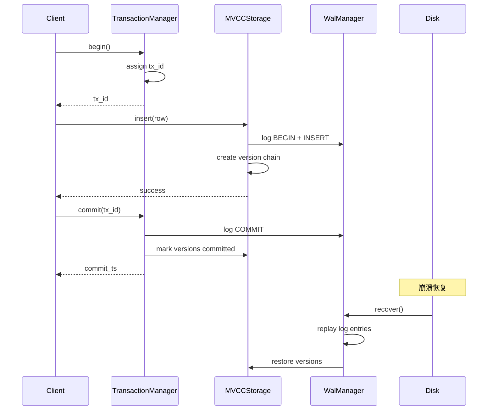

# SQLRustGo v2.5 架构设计文档

**版本**: v2.5.0 (Full Integration + GMP)
**发布日期**: 2026-04-16
**状态**: 里程碑版本正式发布

---

## 一、架构概述

### 1.1 设计目标

v2.5.0 是 SQLRustGo 的里程碑版本，实现了：
- **MVCC 事务**: 快照隔离，支持并发事务处理
- **WAL 持久化**: 崩溃恢复和时间点恢复 (PITR)
- **向量化执行**: SIMD 加速和并行查询
- **图引擎**: Cypher 查询和图遍历
- **向量索引**: HNSW/IVF/IVFPQ + SIMD
- **统一查询**: SQL + 向量 + 图 融合查询
- **OpenClaw 接口**: Agent 框架

### 1.2 系统架构图

```
┌─────────────────────────────────────────────────────────────────────────────┐
│                        SQLRustGo v2.5                              │
├─────────────────────────────────────────────────────────────────────┤
│  Client Layer                                                      │
│  ┌────────────┐  ┌────────────┐  ┌────────────┐  ┌────────────┐    │
│  │  CLI/Repl │  │ HTTP API │  │ MySQL协议 │  │OpenClaw  │    │
│  └────────────┘  └────────────┘  └────────────┘  └────────────┘    │
├─────────────────────────────────────────────────────────────────────┤
│  Query Processing Layer                                             │
│  ┌─────────────────────────────────────────────────────────┐        │
│  │              SQL Parser                                 │        │
│  │  - SQL解析  - 词法分析器  - 表达式解析  - 统计函数    │        │
│  └─────────────────────────────────────────────────────────┘        │
│  ┌─────────────────────────────────────────────────────────┐        │
│  │              Query Planner                          │        │
│  │  - 逻辑计划  - 物理计划  - 代价估算  - 规则变换    │        │
│  └─────────────────────────────────────────────────────────┘        │
│  ┌─────────────────────────────────────────────────────────┐        │
│  │              CBO Optimizer                           │        │
│  │  - 基于成本优化  - 连接重排  - 统计信息  - 规则      │        │
│  └─────────────────────────────────────────────────────────┘        │
├───────────────────────────────────────────────────────────���─────────┤
│  Execution Layer                                                │
│  ┌──────────────────┐  ┌──────────────────────────────────┐      │
│  │ Volcano Executor │  │        Vectorized Executor         │      │
│  │  - 迭代器模型   │  │  - SIMD加速  - 并行执行  - 批处理 │      │
│  └──────────────────┘  └──────────────────────────────────┘      │
│  ┌──────────────────┐  ┌──────────────────────────────────┐      │
│  │   Graph Engine   │  │        Unified Query               │      │
│  │  - Cypher查询   │  │  - SQL+向量+图融合  - 结果融合     │      │
│  └──────────────────┘  └──────────────────────────────────┘      │
├─────────────────────────────────────────────────────────────────────┤
│  Transaction & Storage Layer                                   │
│  ┌──────────────────┐  ┌──────────────────────────────────┐      │
│  │TransactionManager│  │         MVCC Storage             │      │
│  │  - 事务开始/提交 │  │  - 快照隔离  - 版本链  - GC       │      │
│  └──────────────────┘  └──────────────────────────────────┘      │
│  ┌─────────────────────────────────────────────────────────┐        │
│  │              WAL Manager                             │        │
│  │  - 预写日志  - 崩溃恢复  - PITR时间点恢复  - 归档     │        │
│  └─────────────────────────────────────────────────────────┘        │
│  ┌─────────────────────────────────────────────────────────┐        │
│  │              Buffer Pool                              │        │
│  │  - LRU/CLOCK淘汰  - 页面管理  - IO调度                │        │
│  └─────────────────────────────────────────────────────────┘        │
│  ┌──────────────────┐  ┌──────────────────┐  ┌────────────────┐  │
│  │  B+Tree Index  │  │ Vector Index   │  │ Graph Store  │  │
│  │  - 主键索引    │  │ - HNSW/IVF   │  │ - 图持久化   │  │
│  │  - 复合索引   │  │ - IVFPQ+SIMD  │  │ - 属性图    │  │
│  └──────────────────┘  └──────────────────┘  └────────────────┘  │
└─────────────────────────────────────────────────────────────────┘
```

---

## 二、核心模块设计

### 2.1 Query Processing Pipeline

#### What (是什么)
查询处理流水线负责将 SQL 字符串转换为可执行计划并执行。

#### Why (为什么)
分离关注点：解析层负责语法校验，规划层负责逻辑变换，优化层负责执行效率，执行层负责实际数据访问。

#### How (如何实现)

```
SQL String
    │
    ▼
┌─────────────────────────────────────┐
│        SQL Parser                   │
│  - Lexer: tokenization             │
│  - Parser: AST generation        │
│  - Semantic analysis             │
└─────────────────────────────────────┘
    │
    ▼ Logical Plan
┌─────────────────────────────────────┐
│        Query Planner                 │
│  - Rule-based optimization        │
│  - Logical → Physical            │
│  - Index selection             │
└─────────────────────────────────────┘
    │
    ▼ Physical Plan
┌─────────────────────────────────────┐
│        CBO Optimizer                │
│  - Cost model                 │
│  - Join reordering           │
│  - Plan enumeration        │
└─────────────────────────────────────┘
    │
    ▼ Executable Plan
┌─────────────────────────────────────┐
│        Execution Engine            │
│  - Vectorized execution         │
│  - SIMD acceleration          │
│  - Parallel execution        │
└─────────────────────────────────────┘
```

---

### 2.2 MVCC + WAL 集成

#### What (是什么)
MVCC (多版本并发控制) 通过版本链实现无锁读，WAL (预写日志) 确保崩溃恢复。

#### Why (为什么)
- MVCC: 解决并发读写冲突，读者不阻塞写者
- WAL: 崩溃后通过日志重放恢复数据状态
- PITR: 支持时间点恢复

#### How (如何实现)



##### 核心数据结构

```
┌─────────────────────────────────────┐
│      TransactionManager              │
├─────────────────────────────────────┤
│ - tx_counter: AtomicU64            │
│ - active_txs: HashMap<TxId, Tx>  │
│ - snapshots: HashMap<TxId, Snap> │
│ - max_tx_id: u64                  │
└─────────────────────────────────────┘
              │
              │ begin()
              ▼
┌─────────────────────────────────────┐
│         Transaction                 │
├─────────────────────────────────────┤
│ - tx_id: u64                     │
│ - start_ts: u64                  │
│ - snapshot: Snapshot             │
│ - status: TxStatus              │
└─────────────────────────────────────┘
              │
              │ read/write
              ▼
┌─────────────────────────────────────┐
│       MVCCStorage                 │
├─────────────────────────────────────┤
│ - version_chains: VersionChainMap   │
│ - inner: WalStorage            │
│ - gc: GcService            │
└─────────────────────────────────────┘
```

---

### 2.3 向量化执行引擎

#### What (是什么)
向量化执行通过 SIMD 指令集加速数据处理，并行执行通过多线程利用多核 CPU。

#### Why (为什么)
- SIMD: 单条指令处理多条数据，提高吞吐量
- 并行: 利用多核 CPU 处理独立数据分区

#### How (如何实现)

```
Data Batch
    │
    ▼ SIMD Processing
┌─────────────────────────────────────┐
│     AVX-512 Registers                │
│  ┌────┬────┬────┬────┬────┬────┐ │
│  │ v0 │ v1 │ v2 │ v3 │ v4 │ v5 │ ... (16 x 32-bit floats)
│  └────┴────┴────┴────┴────┴────┘ │
└─────────────────────────────────────┘
    │
    ▼ Parallel Chunks
┌─────────────────────────────────────┐
│     Rayon Thread Pool                │
│  ┌──┐ ┌──┐ ┌──┐ ┌──┐           │
│  │T0│ │T1│ │T2│ │T3│ ...        │
│  └──┘ └──┘ └──┘ └──┘           │
└─────────────────────────────────────┘
```

##### SIMD 距离计算示例

```rust
#[cfg(target_arch = "x86_64")]
pub fn euclidean_distance_avx512(a: &[f32], b: &[f32]) -> f32 {
    unsafe {
        let mut sum = _mm512_setzero_ps();
        for chunk in a.chunks(16) {
            let va = _mm512_loadu_ps(chunk.as_ptr());
            let vb = _mm512_loadu_ps(b.as_ptr());
            let diff = _mm512_sub_ps(va, vb);
            sum = _mm512_fmadd_ps(diff, diff, sum);  // sum += diff * diff
        }
        _mm512_reduce_add_ps(sum).sqrt()
    }
}
```

---

### 2.4 图引擎架构

#### What (是什么)
属性图 + Cypher 查询语言 + BFS/DFS 遍历。

#### Why (为什么)
处理关系数据（社交网络、推荐系统）比 SQL 更高效。

#### How (如何实现)

```
Cypher Query
    │
    ▼ Parsing
┌─────────────────────────────────────┐
│      CypherParser                   │
│  - MATCH pattern                  │
│  - WHERE condition               │
│  - RETURN projection            │
└─────────────────────────────────────┘
    │
    ▼ Planning
┌─────────────────────────────────────┐
│      GraphPlanner                 │
│  - Logical → Physical          │
│  - BFS/DFS selection         │
│  - Index planning           │
└─────��─��─────────────────────────────┘
    │
    ▼ Execution
┌─────────────────────────────────────┐
│      GraphExecutor                │
│  - BFSExecutor               │
│  - DFSExecutor               │
│  - MultiHopExecutor          │
└─────────────────────────────────────┘
```

---

### 2.5 向量索引架构

#### What (是什么)
多种向量索引实现：Flat (暴力)、HNSW (分层小世界)、IVF (倒排文件)、IVFPQ (乘积量化)。

#### Why (为什么)
向量搜索场景：AI 检索、语义搜索、推荐系统。

#### How (如何实现)

| 索引类型 | 构建复杂度 | 查询复杂度 | 内存 | 召回率 |
|----------|------------|------------|------|--------|
| Flat | O(n) | O(n) | 100% | 100% |
| HNSW | O(n log n) | O(log n) | ~120% | 95-99% |
| IVF | O(n log k) | O(k log n) | ~110% | 90-95% |
| IVFPQ | O(n log k) | O(log n) | ~10% | 85-90% |

---

### 2.6 统一查询 API

#### What (是什么)
融合 SQL + 向量 + 图查询，统一评分返回。

#### Why (为什么)
混合搜索场景：SQL 条件过滤 + 向量相似度排序 + 图关系扩展。

#### How (如何实现)

```
┌─────────────────────────────────────┐
│      Unified Query Engine           │
├─────────────────────────────────────┤
│ 1. SQL Filter → Result Set A  │
│ 2. Vector Search → Results B │
│ 3. Graph Traverse → Results C│
│ 4. Score Fusion (RRF)      │
│ 5. Return Ranked Results   │
└─────────────────────────────────────┘
```

---

## 三、Crate 依赖关系

```
                        ┌─────────────────────────────┐
                        │      sqlrustgo-cli         │
                        │      (binaries)           │
                        └───────────┬─────────────┘
                                    │
        ┌───────────────────────────┼───────────────────────────┐
        │                           │                           │
        ▼                           ▼                           ▼
┌───────────────┐          ┌───────────────┐          ┌───────────────┐
│ sqlrustgo-server │        │ sqlrustgo-agentsql│       │ sqlrustgo-bench │
└───────┬───────┘          └───────┬───────┘          └───────┬───────┘
        │                          │                          │
        └──────────────────────────┼──────────────────────────┘
                                 │
                    ┌────────────┼────────────┐
                    ▼            ▼            ▼
            ┌───────────┐ ┌───────────┐ ┌───────────┐
            │ sqlrustgo-│ │ sqlrustgo-│ │ sqlrustgo-│
            │ executor  │ │ unified-  │ │ bench    │
            │           │ │ query    │ │           │
            └─────┬───���─��� └─────┬─────┘ └───────────┘
                  │            │
        ┌─────────┼─────────┼──┐
        ▼         ▼         ▼  ▼
┌───────────┐ ┌─────────┐ ┌─────────┐ ┌─────────┐
│ parser   │ │ planner │ │ storage │ │ vector  │
│         │ │         │ │         │ │         │
└─────┬───┘ └────┬────┘ └───┬───┘ └────┬───┘
     │          │           │          │
     │    ┌─────┴────┐     │     ┌───┴───┐
     │    │optimizer │     │     │graph  │
     │    │         │     │     │      │
     │    └────┬────┘     │     └──────┘
     │         │           │
     └─────────┼─────────┘
               │
    ┌─────────┼─────────┐
    │         │         │
    ▼         ▼         ▼
┌───────────┐ ┌───────────┐ ┌───────────┐
│ transaction│ │ catalog  │ │ types   │
│           │ │         │ │         │
└───────────┘ └─────────┘ └───────────┘
```

---

## 四、设计原则

### 4.1 事务安全

| 机制 | 实现 | 作用 |
|------|------|------|
| MVCC | 版本链 + 快照 | 无锁读 |
| WAL | 预写日志 | 崩溃恢复 |
| PITR | 时间点恢复 | 数据回滚 |
| GC | 后台线程 | 版本清理 |

### 4.2 性能优化

| 技术 | 作用 | 效果 |
|------|------|------|
| SIMD | 数据级并行 | 4-16x 加速 |
| 向量化 | 批处理 | 减少函数调用 |
| Rayon | 线程级并行 | 多核利用 |
| BloomFilter | 谓词过滤 | 减少 IO |

### 4.3 扩展性

```
┌─────────────────────────────────────┐
│     Plugin Architecture              │
├─────────────────────────────────────┤
│  - Index Plugin (自定义索引)       │
│  - Function Plugin (自定义函数) │
│  - Storage Plugin (自定义存储) │
└─────────────────────────────────────┘
```

---

## 五、版本演进

### v1.x → v2.0 → v2.5 架构对比

| 维度 | v1.x | v2.0 | v2.5 |
|------|------|------|------|
| 执行模型 | Volcano | Volcano | 向量化 |
| 优化器 | RBO | Cascades | CBO |
| 事务 | 基础锁 | MVCC | MVCC+WAL |
| 图支持 | 无 | 无 | Cypher |
| 向量 | 无 | IVF | HNSW/IVFPQ |
| 并行 | 无 | 无 | SIMD+Rayon |
| 恢复 | 无 | WAL | PITR |

---

## 六、快速导航

| 模块 | 文档 |
|------|------|
| MVCC | [oo/modules/mvcc/MVCC_DESIGN.md](../modules/mvcc/MVCC_DESIGN.md) |
| WAL | [oo/modules/wal/WAL_DESIGN.md](../modules/wal/WAL_DESIGN.md) |
| 向量执行 | [oo/modules/executor/EXECUTOR_DESIGN.md](../modules/executor/EXECUTOR_DESIGN.md) |
| 图引擎 | [oo/modules/graph/GRAPH_DESIGN.md](../modules/graph/GRAPH_DESIGN.md) |
| 向量索引 | [oo/modules/vector/VECTOR_DESIGN.md](../modules/vector/VECTOR_DESIGN.md) |
| 统一查询 | *(已归档)* |
| OpenClaw | *(已归档)* |

---

*本文档由 SQLRustGo Team 维护*
*更新日期: 2026-04-16*