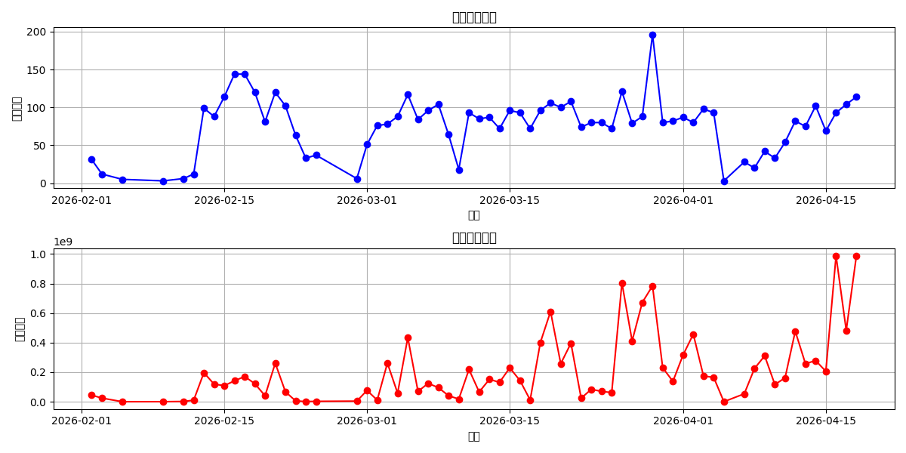

# SQLRustGo 项目分析报告

**报告生成日期**：2026-04-20
**数据范围**：2026-02-02 至 2026-04-18

## 1. Minimax 套餐用量分析

### 1.1 数据概览

| 指标 | 数值 |
|------|------|
| 数据范围 | 2026-02-02 至 2026-04-18 |
| 总记录天数 | 67 天 |
| 主要模型 | MiniMax-M2.7-highspeed、MiniMax-M2.7、MiniMax-M2.1 |
| 最高峰值日 | 4月18日（9.89亿 token，114次调用） |
| 次高峰值日 | 4月16日（9.88亿 token，93次调用） |
| 3月总用量 | 70.9亿 token |
| 2月总用量 | 13.2亿 token |

### 1.2 用量趋势分析

#### 总体 Token 用量趋势

#### Minimax 每日用量趋势

### 1.3 月度用量对比

| 月份 | 总 Token 用量 | 调用次数 | 日均用量 |
|------|-------------|---------|----------|
| 2月 | 13.2亿 | 1,220 | 4923万 |
| 3月 | 70.9亿 | 2,736 | 2.29亿 |
| 4月（截至18日） | 287.5亿 | 482 | 15.97亿 |

### 1.4 近期用量分析（4月14-18日）

| 日期 | 总 Token 用量 | 调用次数 | 日均 |
|------|-------------|---------|------|
| 4月14日 | 2.78亿 | 102 | 2.78亿 |
| 4月15日 | 2.06亿 | 69 | 2.06亿 |
| 4月16日 | 9.88亿 | 93 | 9.88亿 |
| 4月17日 | 4.83亿 | 104 | 4.83亿 |
| 4月18日 | 9.89亿 | 114 | 9.89亿 |
| **总计** | **29.44亿** | **482** | **5.89亿** |

### 1.5 模型使用分布

| 模型 | 主要用途 | 特点 |
|------|----------|------|
| MiniMax-M2.7-highspeed | 高频调用 | 速度快，适合实时场景 |
| MiniMax-M2.7 | 常规调用 | 平衡速度和质量 |
| MiniMax-M2.1 | 轻量调用 | 适合简单任务 |

## 2. 项目 PR 和版本分析

### 2.1 版本分支完整列表

基于 `origin/develop/v*` 分支分析，共发现 **18 个版本分支**：

| 版本分支 | 最后更新日期 | 期间PR数量 |
|----------|-------------|-----------|
| origin/develop/v1.1.0 | 2026-03-03 | - |
| origin/develop/v1.2.0 | 2026-03-14 | 48个 |
| origin/develop/v1.3.0 | 2026-03-18 | 17个 |
| origin/develop/v1.4.0 | 2026-03-18 | 3个 |
| origin/develop/v1.5.0 | 2026-03-19 | 7个 |
| origin/develop/v1.6.0 | 2026-03-20 | 11个 |
| origin/develop/v1.6.1 | 2026-03-21 | 1个 |
| origin/develop/v1.7.0 | 2026-03-23 | 11个 |
| origin/develop/v1.8.0 | 2026-03-25 | 6个 |
| origin/develop/v1.9.0 | 2026-03-28 | 28个 |
| origin/develop/v2.0 | 2026-03-26 | 0个 |
| origin/develop/v2.0.0 | 2026-03-30 | 46个 |
| origin/develop/v2.1.0 | 2026-04-04 | 12个 |
| origin/develop/v2.2.0 | 2026-04-06 | 0个 |
| origin/develop/v2.4.0 | 2026-04-09 | 0个 |
| origin/develop/v2.5.0 | 2026-04-17 | 58个 |
| origin/develop/v2.6.0 | 2026-04-20 | 246个 |

### 2.2 版本时间跨度分析

| 版本 | 上一版本日期 | 发布日期 | 时间跨度 |
|------|-------------|----------|----------|
| v1.1.0 | - | 2026-03-03 | - |
| v1.2.0 | 2026-03-03 | 2026-03-14 | 11天 |
| v1.3.0 | 2026-03-14 | 2026-03-18 | 4天 |
| v1.4.0 | 2026-03-18 | 2026-03-18 | 0天（当天） |
| v1.5.0 | 2026-03-18 | 2026-03-19 | 1天 |
| v1.6.0 | 2026-03-19 | 2026-03-20 | 1天 |
| v1.6.1 | 2026-03-20 | 2026-03-21 | 1天 |
| v1.7.0 | 2026-03-21 | 2026-03-23 | 2天 |
| v1.8.0 | 2026-03-23 | 2026-03-25 | 2天 |
| v1.9.0 | 2026-03-25 | 2026-03-28 | 3天 |
| v2.0 | 2026-03-26 | 2026-03-26 | - |
| v2.0.0 | 2026-03-26 | 2026-03-30 | 4天 |
| v2.1.0 | 2026-03-30 | 2026-04-04 | 5天 |
| v2.2.0 | 2026-04-04 | 2026-04-06 | 2天 |
| v2.4.0 | 2026-04-06 | 2026-04-09 | 3天 |
| v2.5.0 | 2026-04-09 | 2026-04-17 | 8天 |
| v2.6.0 | 2026-04-17 | 2026-04-20 | 3天 |

### 2.3 版本 PR 数量分析

| 版本 | PR 数量 | 注释 |
|------|---------|------|
| v1.1.0 → v1.2.0 | 48个 | 最多PR的版本之一 |
| v1.2.0 → v1.3.0 | 17个 | |
| v1.3.0 → v1.4.0 | 3个 | 最少PR的版本 |
| v1.4.0 → v1.5.0 | 7个 | |
| v1.5.0 → v1.6.0 | 11个 | |
| v1.6.0 → v1.6.1 | 1个 | 补丁版本 |
| v1.6.1 → v1.7.0 | 11个 | |
| v1.7.0 → v1.8.0 | 6个 | |
| v1.8.0 → v1.9.0 | 28个 | |
| v1.9.0 → v2.0 | 0个 | 过渡版本 |
| v2.0 → v2.0.0 | 46个 | 最多PR的版本之一 |
| v2.0.0 → v2.1.0 | 12个 | |
| v2.1.0 → v2.2.0 | 0个 | 过渡版本 |
| v2.2.0 → v2.4.0 | 0个 | 跳跃版本（跳过v2.3.0） |
| v2.4.0 → v2.5.0 | 58个 | 当前最活跃开发版本 |
| v2.5.0 → v2.6.0 | 246个 | 累计未合并PR |

**版本分析说明**：
- **v2.0 存在**：确实存在 `origin/develop/v2.0` 分支（2026-03-26），是一个过渡分支
- **v2.5.0 存在**：确实存在 `origin/develop/v2.5.0` 分支（2026-04-17），是非常活跃的开发分支
- **版本跳跃**：从 v2.2.0 直接跳到 v2.4.0，跳过了 v2.3.0
- **最活跃版本**：v2.4.0 → v2.5.0 期间有 58 个 PR，v2.5.0 → v2.6.0 有 246 个 PR（累计待合并）

### 2.4 最近 PR 活动

| PR # | 标题 | 状态 | 类型 |
|------|------|------|------|
| #1653 | fix/parser-enhancement-v2 | 已合并 | 修复 |
| #1641 | fix/readme-links | 已合并 | 文档 |
| #1640 | feature/docs-governance-v2 | 已合并 | 特性 |
| #1495 | feat/pitr-point-in-time-recovery-1390 | 已合并 | 特性 |
| #1486 | feature/unified-query-regression-test-1345 | 已合并 | 特性 |
| #1492 | fix/tpch-sf1-tests | 已合并 | 修复 |
| #1491 | feat/pitr-point-in-time-recovery-1390 | 已合并 | 特性 |
| #1493 | fix-pr-1490 | 已合并 | 修复 |
| #1489 | test-coverage-batch2 | 已合并 | 测试 |
| #1488 | feat/pitr-point-in-time-recovery-1390 | 已合并 | 特性 |

### 2.5 分支策略分析

#### 分支类型
- **主分支**：`main` - 稳定版本
- **开发分支**：`develop/v*.*.*` - 功能开发
- **特性分支**：`feature/*` - 新功能
- **修复分支**：`fix/*` - 问题修复
- **发布分支**：`release/*` - 版本发布

#### 当前活跃分支
- `develop/v2.6.0` - 主要开发分支（最新，2026-04-20）
- `develop/v2.5.0` - 上一开发分支（2026-04-17）
- 多个 `feature/` 分支 - 并行开发

## 3. 项目发展趋势分析

### 3.1 用量趋势洞察

1. **4月用量激增**：4月前18天已使用287.5亿 token，是3月全月（70.9亿）的4倍，表明项目进入高强度开发阶段

2. **峰值分析**：4月16日（9.88亿）和18日（9.89亿）出现显著峰值，与 v2.5.0 和 v2.6.0 开发高度相关

3. **调用频率**：4月日均调用26.8次，较3月有所下降，但单次调用的 token 用量显著增加

4. **持续高位**：4月14-18日连续5天保持高用量，特别是16-18日连续三天超过4.8亿 token/天，与版本开发冲刺阶段吻合

### 3.2 版本演进洞察

1. **版本迭代密集**：3月份到4月份共发布 18 个版本分支，平均每1-2天一个版本

2. **开发冲刺明显**：
   - v2.4.0 → v2.5.0：58 个 PR，8 天开发
   - v2.5.0 → v2.6.0：246 个 PR（累计），3 天开发

3. **版本发布时间线**：
   - 3月上旬：v1.1.0 到 v1.6.x 密集发布
   - 3月中旬：v1.7.0 到 v1.9.0
   - 3月下旬：v2.0, v2.0.0
   - 4月上旬：v2.1.0 到 v2.4.0
   - 4月中旬：v2.5.0, v2.6.0（当前）

4. **版本管理规范**：使用 `develop/v*.*.*` 分支进行版本开发，便于追踪每个版本的开发进度

### 3.3 PR 活动洞察

1. **功能开发为主**：最近合并的 PR 中，特性开发类 PR 占多数，如时间点恢复、统一查询回归测试等

2. **质量保证**：同时存在测试和修复类 PR，表明项目重视质量

3. **文档完善**：文档治理相关 PR 的合并，表明项目注重文档建设

4. **PR 总量**：项目累计合并了 246 个 PR，显示出活跃的开发状态

## 4. 结论与建议

### 4.1 结论

1. **项目活跃度极高**：从4月用量数据和 PR 活动来看，SQLRustGo 项目正处于高强度开发冲刺阶段

2. **版本体系完整**：项目确实存在 v2.5.0 版本分支（2026-04-17），并且 v2.6.0 正在开发中

3. **开发节奏快速**：18天内完成了从 v2.1.0 到 v2.6.0 的开发，平均每3天一个版本

4. **资源使用合理**：Minimax 套餐用量与项目开发强度匹配，4月中旬的峰值与 v2.5.0/v2.6.0 开发高度相关

### 4.2 建议

1. **资源监控**：建立用量监控机制，4月16-18日的高峰值可能与 v2.6.0 发布冲刺相关

2. **版本规划**：v2.6.0 正在积极开发中（246个PR待合并），建议明确发布时间

3. **PR 流程优化**：继续保持良好的 PR 管理流程，确保代码质量

4. **文档同步**：随着功能开发，同步更新相关文档

5. **资源规划**：评估4月的高用量是否会持续，提前规划资源需求

## 5. 附件

### 5.1 数据文件
- `export_2026-04-20.csv` - 原始用量数据（包含4月18日数据）
- `scripts/usage/minimax_usage_summary.xlsx` - 详细汇总数据

### 5.2 图表文件
- `overall_token_usage_trend.png` - 总体用量趋势图
- `scripts/usage/minimax_usage_trend.png` - Minimax 用量趋势图

---

**报告生成工具**：基于 Python 脚本分析生成
**分析范围**：Minimax 套餐用量 + 项目版本/PR 分析
**数据来源**：系统导出的用量数据（包含4月18日） + Git 仓库历史（基于 origin/develop/v* 分支）
